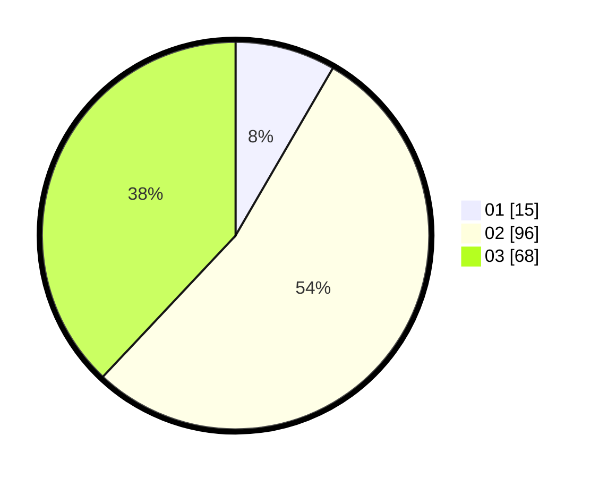

# Hasil

Hasil perolehan suara paslon dapat dilihat pada file paslon-01.txt, paslon-02.txt, dan paslon-03.txt.

Jika tidak ada, artinya data tersebut belum ada pada SIREKAP.

## Perolehan Suara

 * Paslon 01: **15**.
 * Paslon 02: **96**.
 * Paslon 03: **68**.

## Foto C Plano

https://sirekap-obj-formc.kpu.go.id/94fa/pemilu/ppwp/31/71/02/10/05/3171021005060-20240215-222415--8969241e-b92f-4d88-aad5-83982919032f.jpg

https://sirekap-obj-formc.kpu.go.id/94fa/pemilu/ppwp/31/71/02/10/05/3171021005060-20240215-222418--358403ec-bcf5-440a-b3c9-bbc01ab91284.jpg

https://sirekap-obj-formc.kpu.go.id/94fa/pemilu/ppwp/31/71/02/10/05/3171021005060-20240215-222416--87e97d20-fc58-4bcf-928c-c5500dfaacf1.jpg

## DATA PEMILIH TETAP

Jumlah pemilih dalam DPT: **253**.
 * L: **121**.
 * P: **132**.

## DATA PENGGUNA HAK PILIH

Jumlah pengguna hak pilih dalam DPT: **180**.
 * L: **85**.
 * P: **95**.

Jumlah pengguna hak pilih dalam DPTb: **2**.
 * L: **0**.
 * P: **2**.

Jumlah pengguna hak pilih dalam DPK: **1**.
 * L: **1**.
 * P: **0**.

Jumlah pengguna hak pilih: **183**.
 * L: **86**.
 * P: **97**.

## JUMLAH SUARA SAH DAN TIDAK SAH

JUMLAH SELURUH SUARA SAH: **179**.

JUMLAH SUARA TIDAK SAH: **4**.

JUMLAH SELURUH SUARA SAH DAN SUARA TIDAK SAH: **183**.
