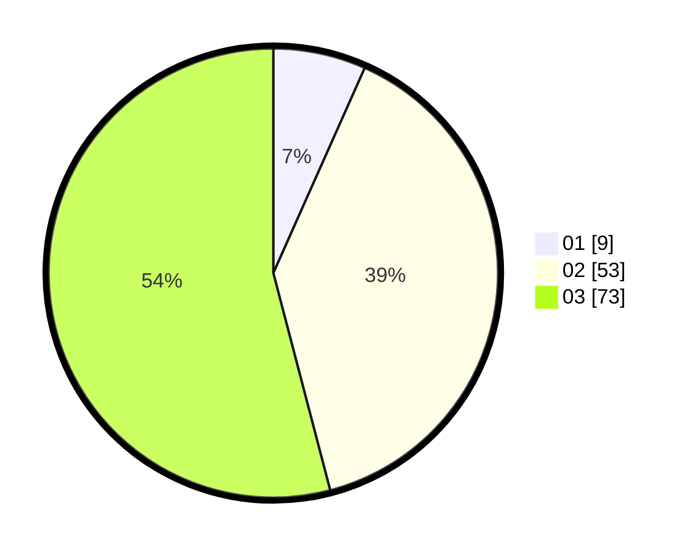

# Hasil

Hasil perolehan suara paslon dapat dilihat pada file paslon-01.txt, paslon-02.txt, dan paslon-03.txt.

Jika tidak ada, artinya data tersebut belum ada pada SIREKAP.

## Perolehan Suara

 * Paslon 01: **9**.
 * Paslon 02: **53**.
 * Paslon 03: **73**.

## Foto C Plano

https://sirekap-obj-formc.kpu.go.id/dee7/pemilu/ppwp/31/71/02/10/05/3171021005062-20240214-234919--56546fd6-751d-425f-ab58-4a9e219f0fd7.jpg

https://sirekap-obj-formc.kpu.go.id/dee7/pemilu/ppwp/31/71/02/10/05/3171021005062-20240214-234638--208bcbd4-d60c-4a81-8d5c-fb1c80aefdb2.jpg

https://sirekap-obj-formc.kpu.go.id/dee7/pemilu/ppwp/31/71/02/10/05/3171021005062-20240214-155858--9080a8e1-d090-4e30-b17a-035d9f787088.jpg

## DATA PEMILIH TETAP

Jumlah pemilih dalam DPT: **242**.
 * L: **128**.
 * P: **114**.

## DATA PENGGUNA HAK PILIH

Jumlah pengguna hak pilih dalam DPT: **130**.
 * L: **72**.
 * P: **58**.

Jumlah pengguna hak pilih dalam DPTb: **3**.
 * L: **1**.
 * P: **2**.

Jumlah pengguna hak pilih dalam DPK: **4**.
 * L: **1**.
 * P: **3**.

Jumlah pengguna hak pilih: **137**.
 * L: **74**.
 * P: **63**.

## JUMLAH SUARA SAH DAN TIDAK SAH

JUMLAH SELURUH SUARA SAH: **135**.

JUMLAH SUARA TIDAK SAH: **2**.

JUMLAH SELURUH SUARA SAH DAN SUARA TIDAK SAH: **137**.
