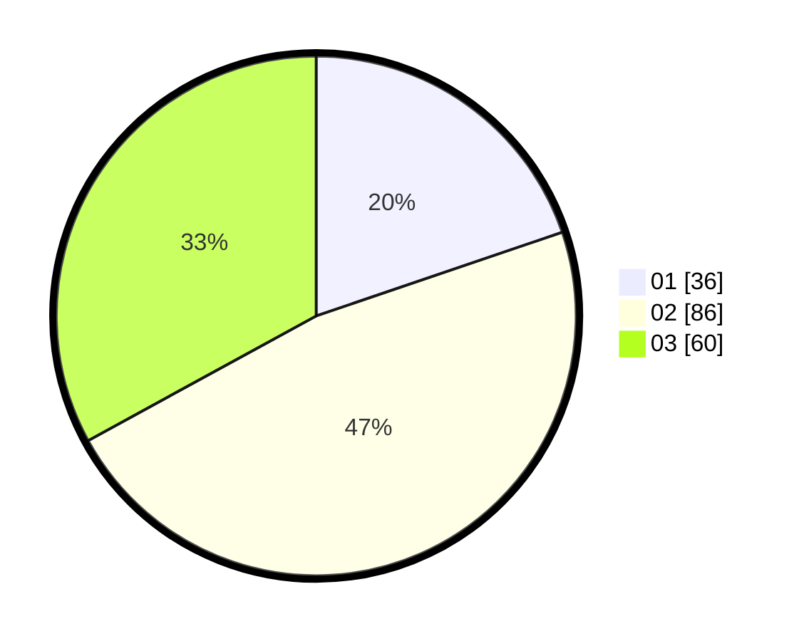

# Hasil

Hasil perolehan suara paslon dapat dilihat pada file paslon-01.txt, paslon-02.txt, dan paslon-03.txt.

Jika tidak ada, artinya data tersebut belum ada pada SIREKAP.

## Perolehan Suara

 * Paslon 01: **36**.
 * Paslon 02: **86**.
 * Paslon 03: **60**.

## Foto C Plano

https://sirekap-obj-formc.kpu.go.id/4372/pemilu/ppwp/31/71/02/10/05/3171021005063-20240214-203331--83fd2920-c969-47bf-969e-2018e7cc9b19.jpg

https://sirekap-obj-formc.kpu.go.id/4372/pemilu/ppwp/31/71/02/10/05/3171021005063-20240214-203456--a3ee708a-dc7f-44da-82ee-5a6d7edccc62.jpg

https://sirekap-obj-formc.kpu.go.id/4372/pemilu/ppwp/31/71/02/10/05/3171021005063-20240214-203713--5e37e9ea-b169-4f85-bc07-bf676a6cd309.jpg

## DATA PEMILIH TETAP

Jumlah pemilih dalam DPT: **269**.
 * L: **144**.
 * P: **125**.

## DATA PENGGUNA HAK PILIH

Jumlah pengguna hak pilih dalam DPT: **179**.
 * L: **88**.
 * P: **91**.

Jumlah pengguna hak pilih dalam DPTb: **7**.
 * L: **2**.
 * P: **5**.

Jumlah pengguna hak pilih dalam DPK: **2**.
 * L: **1**.
 * P: **1**.

Jumlah pengguna hak pilih: **188**.
 * L: **91**.
 * P: **97**.

## JUMLAH SUARA SAH DAN TIDAK SAH

JUMLAH SELURUH SUARA SAH: **182**.

JUMLAH SUARA TIDAK SAH: **6**.

JUMLAH SELURUH SUARA SAH DAN SUARA TIDAK SAH: **188**.
