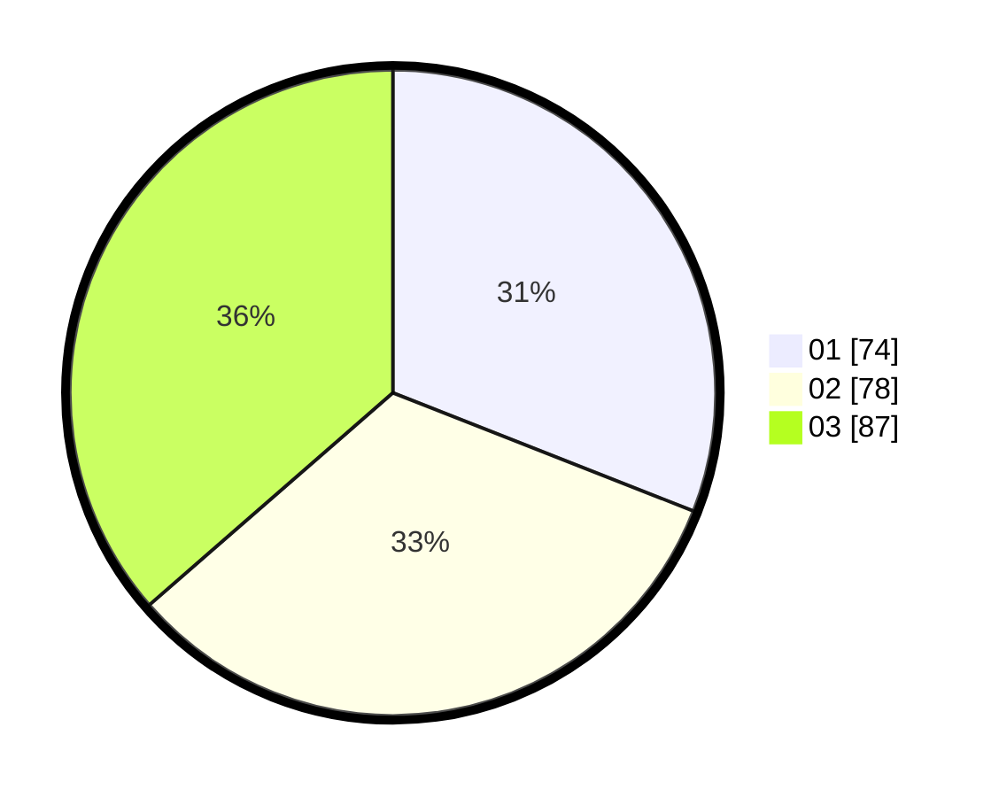

# Hasil

Hasil perolehan suara paslon dapat dilihat pada file paslon-01.txt, paslon-02.txt, dan paslon-03.txt.

Jika tidak ada, artinya data tersebut belum ada pada SIREKAP.

## Perolehan Suara

 * Paslon 01: **74**.
 * Paslon 02: **78**.
 * Paslon 03: **87**.

## Foto C Plano

https://sirekap-obj-formc.kpu.go.id/dd31/pemilu/ppwp/31/71/02/10/05/3171021005066-20240217-190502--b8f1e302-6a6d-45af-8985-afb4384c2f59.jpg

https://sirekap-obj-formc.kpu.go.id/dd31/pemilu/ppwp/31/71/02/10/05/3171021005066-20240216-095013--45b6284e-0b92-4145-a5cb-73ceaf423968.jpg

https://sirekap-obj-formc.kpu.go.id/dd31/pemilu/ppwp/31/71/02/10/05/3171021005066-20240217-190503--c701822d-8c3b-4a61-96e3-eacfe861b294.jpg

## DATA PEMILIH TETAP

Jumlah pemilih dalam DPT: **279**.
 * L: **142**.
 * P: **137**.

## DATA PENGGUNA HAK PILIH

Jumlah pengguna hak pilih dalam DPT: **199**.
 * L: **105**.
 * P: **94**.

Jumlah pengguna hak pilih dalam DPTb: **1**.
 * L: **1**.
 * P: **0**.

Jumlah pengguna hak pilih dalam DPK: **1**.
 * L: **1**.
 * P: **0**.

Jumlah pengguna hak pilih: **201**.
 * L: **107**.
 * P: **94**.

## JUMLAH SUARA SAH DAN TIDAK SAH

JUMLAH SELURUH SUARA SAH: **199**.

JUMLAH SUARA TIDAK SAH: **2**.

JUMLAH SELURUH SUARA SAH DAN SUARA TIDAK SAH: **201**.
