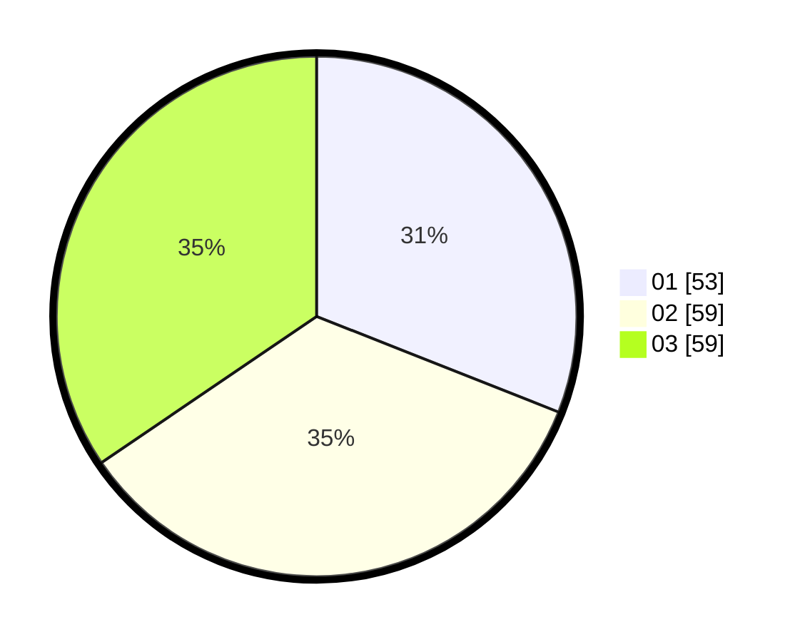

# Hasil

Hasil perolehan suara paslon dapat dilihat pada file paslon-01.txt, paslon-02.txt, dan paslon-03.txt.

Jika tidak ada, artinya data tersebut belum ada pada SIREKAP.

## Perolehan Suara

 * Paslon 01: **53**.
 * Paslon 02: **59**.
 * Paslon 03: **59**.

## Foto C Plano

https://sirekap-obj-formc.kpu.go.id/25f6/pemilu/ppwp/31/71/02/10/05/3171021005071-20240216-150300--1fbe1c62-b2c6-4be6-8014-ce45b5ec8394.jpg

https://sirekap-obj-formc.kpu.go.id/25f6/pemilu/ppwp/31/71/02/10/05/3171021005071-20240216-150302--e826caa7-f1d5-4c49-9187-92690e1c8801.jpg

https://sirekap-obj-formc.kpu.go.id/25f6/pemilu/ppwp/31/71/02/10/05/3171021005071-20240216-150301--36531278-e1c0-48d1-b2a5-55e56e2064fc.jpg

## DATA PEMILIH TETAP

Jumlah pemilih dalam DPT: **239**.
 * L: **131**.
 * P: **108**.

## DATA PENGGUNA HAK PILIH

Jumlah pengguna hak pilih dalam DPT: **173**.
 * L: **99**.
 * P: **74**.

Jumlah pengguna hak pilih dalam DPTb: **0**.
 * L: **0**.
 * P: **0**.

Jumlah pengguna hak pilih dalam DPK: **2**.
 * L: **0**.
 * P: **2**.

Jumlah pengguna hak pilih: **175**.
 * L: **99**.
 * P: **76**.

## JUMLAH SUARA SAH DAN TIDAK SAH

JUMLAH SELURUH SUARA SAH: **171**.

JUMLAH SUARA TIDAK SAH: **4**.

JUMLAH SELURUH SUARA SAH DAN SUARA TIDAK SAH: **175**.
