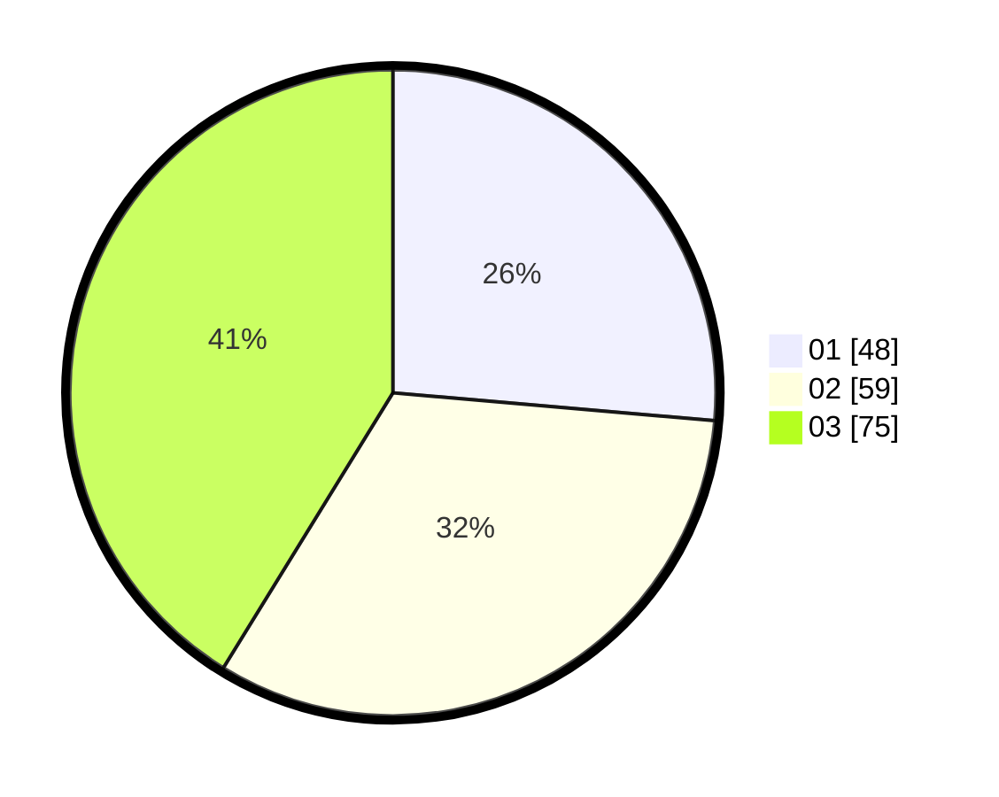

# Hasil

Hasil perolehan suara paslon dapat dilihat pada file paslon-01.txt, paslon-02.txt, dan paslon-03.txt.

Jika tidak ada, artinya data tersebut belum ada pada SIREKAP.

## Perolehan Suara

 * Paslon 01: **48**.
 * Paslon 02: **59**.
 * Paslon 03: **75**.

## Foto C Plano

https://sirekap-obj-formc.kpu.go.id/fd60/pemilu/ppwp/31/71/02/10/05/3171021005073-20240214-191329--ee4b9b91-c78b-408f-8318-6f10e7accf6c.jpg

https://sirekap-obj-formc.kpu.go.id/fd60/pemilu/ppwp/31/71/02/10/05/3171021005073-20240214-191439--68141129-f912-422f-9917-d7c1a24c4516.jpg

https://sirekap-obj-formc.kpu.go.id/fd60/pemilu/ppwp/31/71/02/10/05/3171021005073-20240214-191105--8a8ab0d4-550a-4032-a6d9-fc209315a105.jpg

## DATA PEMILIH TETAP

Jumlah pemilih dalam DPT: **257**.
 * L: **125**.
 * P: **132**.

## DATA PENGGUNA HAK PILIH

Jumlah pengguna hak pilih dalam DPT: **176**.
 * L: **87**.
 * P: **89**.

Jumlah pengguna hak pilih dalam DPTb: **3**.
 * L: **1**.
 * P: **2**.

Jumlah pengguna hak pilih dalam DPK: **4**.
 * L: **3**.
 * P: **1**.

Jumlah pengguna hak pilih: **183**.
 * L: **91**.
 * P: **92**.

## JUMLAH SUARA SAH DAN TIDAK SAH

JUMLAH SELURUH SUARA SAH: **182**.

JUMLAH SUARA TIDAK SAH: **1**.

JUMLAH SELURUH SUARA SAH DAN SUARA TIDAK SAH: **183**.
