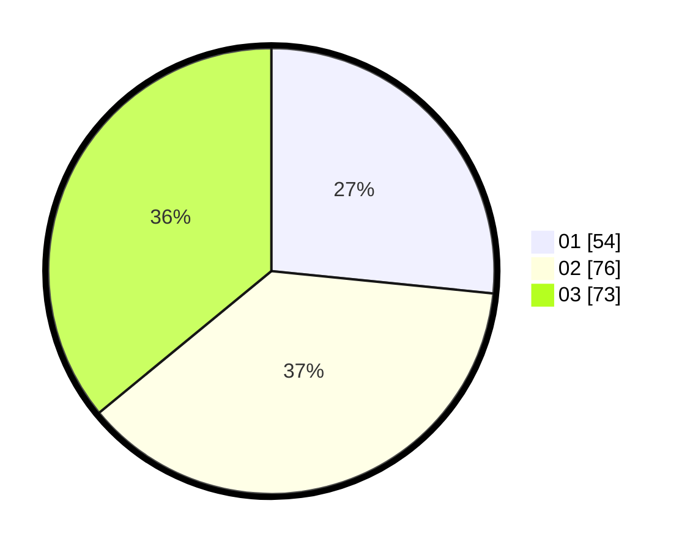

# Hasil

Hasil perolehan suara paslon dapat dilihat pada file paslon-01.txt, paslon-02.txt, dan paslon-03.txt.

Jika tidak ada, artinya data tersebut belum ada pada SIREKAP.

## Perolehan Suara

 * Paslon 01: **54**.
 * Paslon 02: **76**.
 * Paslon 03: **73**.

## Foto C Plano

https://sirekap-obj-formc.kpu.go.id/97d2/pemilu/ppwp/31/71/02/10/05/3171021005074-20240216-134911--8bdeacd6-8573-43ab-a205-feadc47cde64.jpg

https://sirekap-obj-formc.kpu.go.id/97d2/pemilu/ppwp/31/71/02/10/05/3171021005074-20240215-203618--23180abe-5b62-4b23-b5c4-8dc3c0ed6351.jpg

https://sirekap-obj-formc.kpu.go.id/97d2/pemilu/ppwp/31/71/02/10/05/3171021005074-20240215-203715--af7adcc7-b895-4b3e-be20-b8864d8e8e5d.jpg
