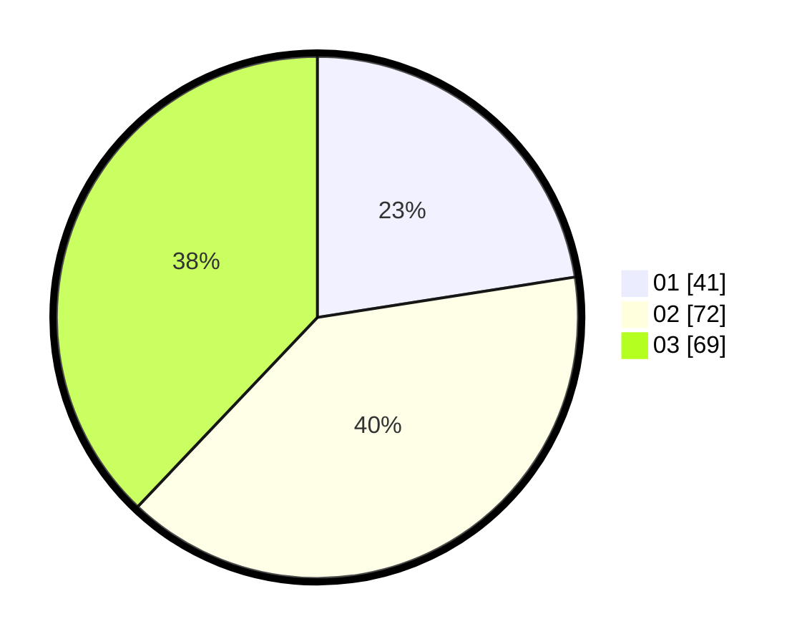

# Hasil

Hasil perolehan suara paslon dapat dilihat pada file paslon-01.txt, paslon-02.txt, dan paslon-03.txt.

Jika tidak ada, artinya data tersebut belum ada pada SIREKAP.

## Perolehan Suara

 * Paslon 01: **41**.
 * Paslon 02: **72**.
 * Paslon 03: **69**.

## Foto C Plano

https://sirekap-obj-formc.kpu.go.id/4ab8/pemilu/ppwp/31/71/02/10/05/3171021005075-20240216-100344--0ea638b4-68b9-461a-94ec-e0bb2b1af74a.jpg

https://sirekap-obj-formc.kpu.go.id/4ab8/pemilu/ppwp/31/71/02/10/05/3171021005075-20240216-100346--74b87262-ce24-424e-bb21-67bc9a899b09.jpg

https://sirekap-obj-formc.kpu.go.id/4ab8/pemilu/ppwp/31/71/02/10/05/3171021005075-20240216-100345--af16ae81-fe0c-4c27-8250-cf96016204ed.jpg

## DATA PEMILIH TETAP

Jumlah pemilih dalam DPT: **250**.
 * L: **116**.
 * P: **134**.

## DATA PENGGUNA HAK PILIH

Jumlah pengguna hak pilih dalam DPT: **181**.
 * L: **79**.
 * P: **102**.

Jumlah pengguna hak pilih dalam DPTb: **0**.
 * L: **0**.
 * P: **0**.

Jumlah pengguna hak pilih dalam DPK: **3**.
 * L: **1**.
 * P: **2**.

Jumlah pengguna hak pilih: **184**.
 * L: **80**.
 * P: **104**.

## JUMLAH SUARA SAH DAN TIDAK SAH

JUMLAH SELURUH SUARA SAH: **182**.

JUMLAH SUARA TIDAK SAH: **2**.

JUMLAH SELURUH SUARA SAH DAN SUARA TIDAK SAH: **184**.
