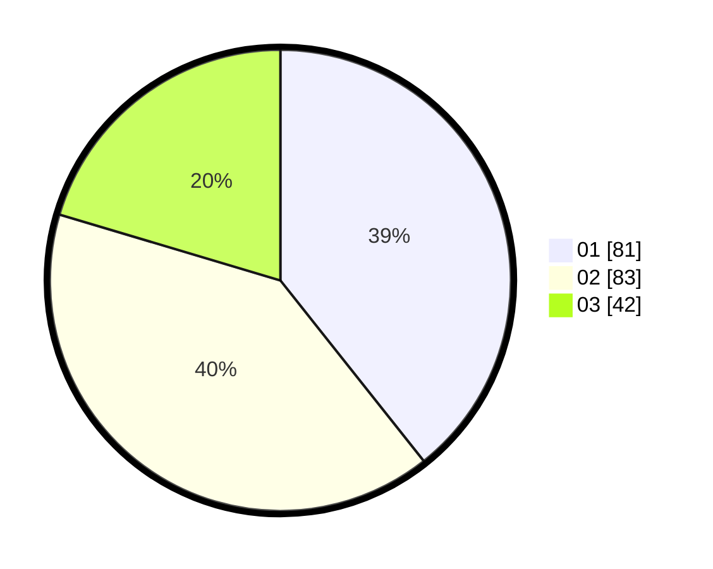

# Hasil

Hasil perolehan suara paslon dapat dilihat pada file paslon-01.txt, paslon-02.txt, dan paslon-03.txt.

Jika tidak ada, artinya data tersebut belum ada pada SIREKAP.

## Perolehan Suara

 * Paslon 01: **81**.
 * Paslon 02: **83**.
 * Paslon 03: **42**.

## Foto C Plano

https://sirekap-obj-formc.kpu.go.id/de76/pemilu/ppwp/31/71/02/10/05/3171021005076-20240216-093143--ce1fb2c1-07df-4de7-aaa8-01a09e5cea9e.jpg

https://sirekap-obj-formc.kpu.go.id/de76/pemilu/ppwp/31/71/02/10/05/3171021005076-20240216-093145--7f08eb7b-9dd9-4d27-852f-df354e92a4b0.jpg

https://sirekap-obj-formc.kpu.go.id/de76/pemilu/ppwp/31/71/02/10/05/3171021005076-20240216-093144--27dbc819-0f02-4adb-8257-48d6e95b9391.jpg

## DATA PEMILIH TETAP

Jumlah pemilih dalam DPT: **265**.
 * L: **139**.
 * P: **126**.

## DATA PENGGUNA HAK PILIH

Jumlah pengguna hak pilih dalam DPT: **188**.
 * L: **95**.
 * P: **93**.

Jumlah pengguna hak pilih dalam DPTb: **7**.
 * L: **2**.
 * P: **5**.

Jumlah pengguna hak pilih dalam DPK: **11**.
 * L: **7**.
 * P: **4**.

Jumlah pengguna hak pilih: **206**.
 * L: **102**.
 * P: **104**.

## JUMLAH SUARA SAH DAN TIDAK SAH

JUMLAH SELURUH SUARA SAH: **206**.

JUMLAH SUARA TIDAK SAH: **0**.

JUMLAH SELURUH SUARA SAH DAN SUARA TIDAK SAH: **206**.
