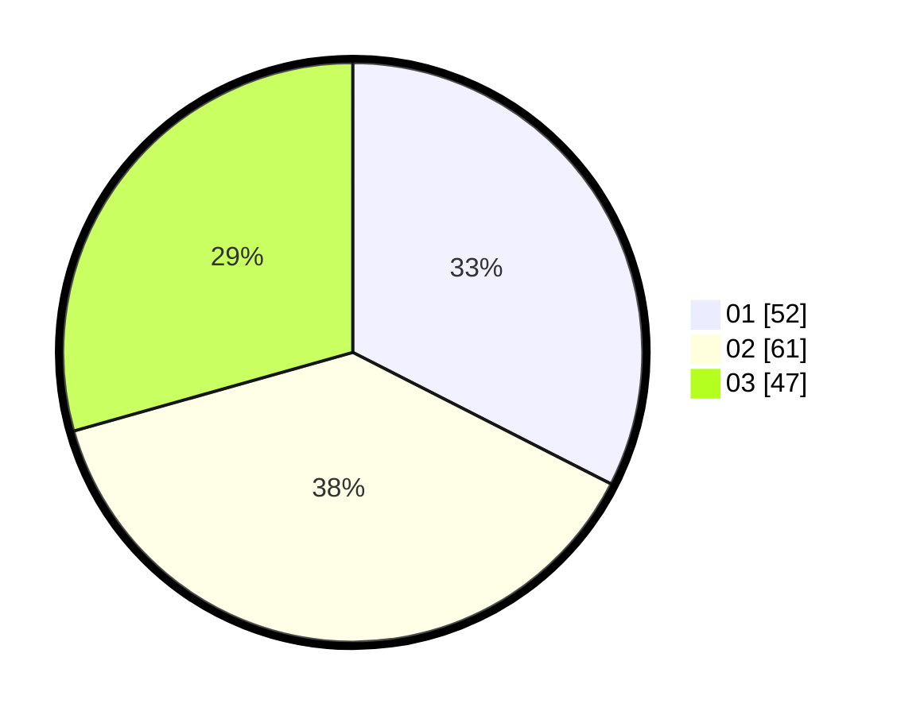

# Hasil

Hasil perolehan suara paslon dapat dilihat pada file paslon-01.txt, paslon-02.txt, dan paslon-03.txt.

Jika tidak ada, artinya data tersebut belum ada pada SIREKAP.

## Perolehan Suara

 * Paslon 01: **52**.
 * Paslon 02: **61**.
 * Paslon 03: **47**.

## Foto C Plano

https://sirekap-obj-formc.kpu.go.id/a816/pemilu/ppwp/31/71/02/10/05/3171021005079-20240215-015652--f4609a60-17f5-4596-86de-9d10a2429633.jpg

https://sirekap-obj-formc.kpu.go.id/a816/pemilu/ppwp/31/71/02/10/05/3171021005079-20240215-015729--55ddab8d-450c-4b51-92a5-b2b0b9352cdd.jpg

https://sirekap-obj-formc.kpu.go.id/a816/pemilu/ppwp/31/71/02/10/05/3171021005079-20240215-015758--e119e73c-e730-478e-af49-da4afdccc86f.jpg

## DATA PEMILIH TETAP

Jumlah pemilih dalam DPT: **249**.
 * L: **115**.
 * P: **134**.

## DATA PENGGUNA HAK PILIH

Jumlah pengguna hak pilih dalam DPT: **161**.
 * L: **75**.
 * P: **86**.

Jumlah pengguna hak pilih dalam DPTb: **0**.
 * L: **0**.
 * P: **0**.

Jumlah pengguna hak pilih dalam DPK: **0**.
 * L: **0**.
 * P: **0**.

Jumlah pengguna hak pilih: **161**.
 * L: **75**.
 * P: **86**.

## JUMLAH SUARA SAH DAN TIDAK SAH

JUMLAH SELURUH SUARA SAH: **160**.

JUMLAH SUARA TIDAK SAH: **1**.

JUMLAH SELURUH SUARA SAH DAN SUARA TIDAK SAH: **161**.
