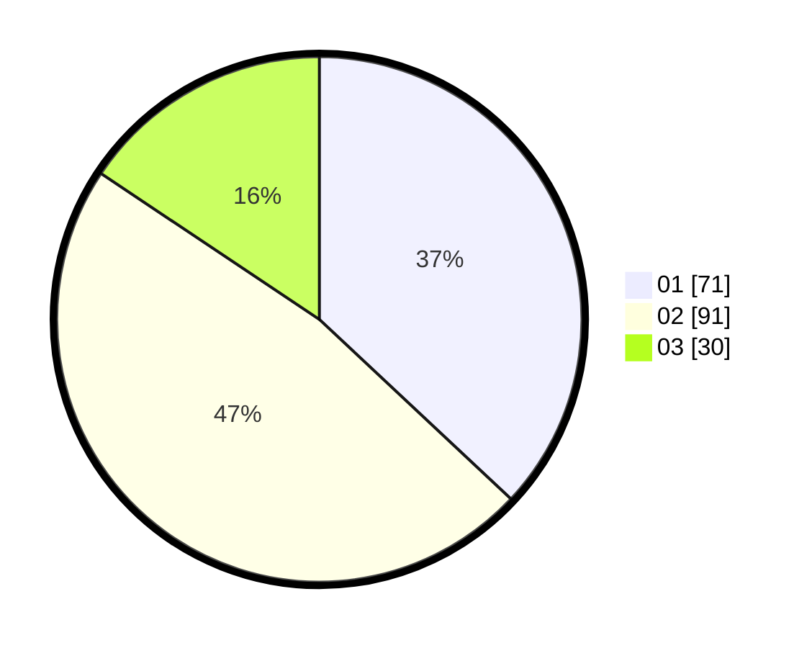

# Hasil

Hasil perolehan suara paslon dapat dilihat pada file paslon-01.txt, paslon-02.txt, dan paslon-03.txt.

Jika tidak ada, artinya data tersebut belum ada pada SIREKAP.

## Perolehan Suara

 * Paslon 01: **71**.
 * Paslon 02: **91**.
 * Paslon 03: **30**.

## Foto C Plano

https://sirekap-obj-formc.kpu.go.id/d1da/pemilu/ppwp/31/71/02/10/05/3171021005082-20240218-001425--22c4e507-3877-4387-b26b-eb9b881412db.jpg

https://sirekap-obj-formc.kpu.go.id/d1da/pemilu/ppwp/31/71/02/10/05/3171021005082-20240218-002248--ba845c6b-2ad1-43c3-96ea-50e80dad5a59.jpg

https://sirekap-obj-formc.kpu.go.id/d1da/pemilu/ppwp/31/71/02/10/05/3171021005082-20240218-003129--6c0627ea-3619-4379-9179-2b9e70fe90ce.jpg

## DATA PEMILIH TETAP

Jumlah pemilih dalam DPT: **275**.
 * L: **147**.
 * P: **128**.

## DATA PENGGUNA HAK PILIH

Jumlah pengguna hak pilih dalam DPT: **191**.
 * L: **97**.
 * P: **94**.

Jumlah pengguna hak pilih dalam DPTb: **0**.
 * L: **0**.
 * P: **0**.

Jumlah pengguna hak pilih dalam DPK: **3**.
 * L: **1**.
 * P: **2**.

Jumlah pengguna hak pilih: **194**.
 * L: **98**.
 * P: **96**.

## JUMLAH SUARA SAH DAN TIDAK SAH

JUMLAH SELURUH SUARA SAH: **192**.

JUMLAH SUARA TIDAK SAH: **2**.

JUMLAH SELURUH SUARA SAH DAN SUARA TIDAK SAH: **194**.
