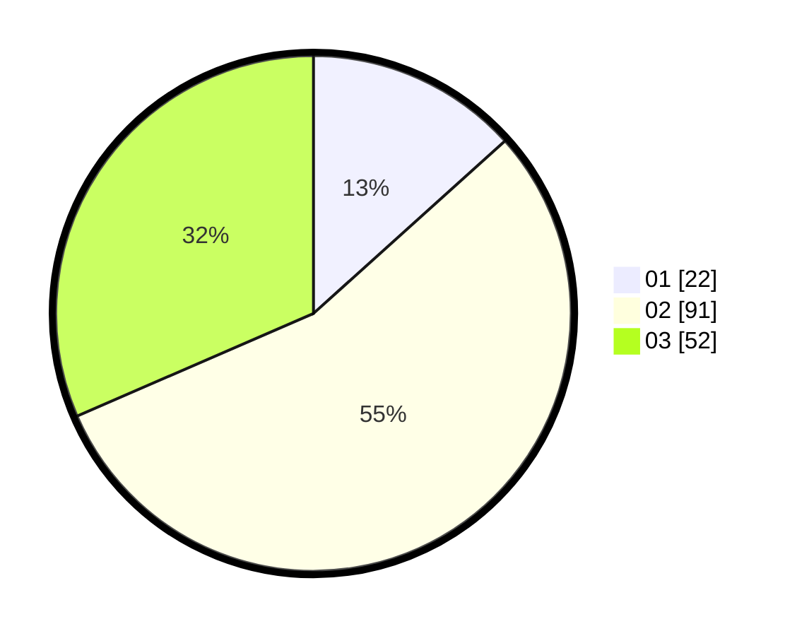

# Hasil

Hasil perolehan suara paslon dapat dilihat pada file paslon-01.txt, paslon-02.txt, dan paslon-03.txt.

Jika tidak ada, artinya data tersebut belum ada pada SIREKAP.

## Perolehan Suara

 * Paslon 01: **22**.
 * Paslon 02: **91**.
 * Paslon 03: **52**.

## Foto C Plano

https://sirekap-obj-formc.kpu.go.id/808c/pemilu/ppwp/31/71/02/10/05/3171021005086-20240217-222815--b43000d7-9fed-4fc6-b1ad-816bc4c08d0b.jpg

https://sirekap-obj-formc.kpu.go.id/808c/pemilu/ppwp/31/71/02/10/05/3171021005086-20240217-223741--65119996-171c-49e3-8018-1667efedb61e.jpg

https://sirekap-obj-formc.kpu.go.id/808c/pemilu/ppwp/31/71/02/10/05/3171021005086-20240217-224516--e6cec8c6-c1a1-402c-8528-629ef5908f30.jpg

## DATA PEMILIH TETAP

Jumlah pemilih dalam DPT: **272**.
 * L: **140**.
 * P: **132**.

## DATA PENGGUNA HAK PILIH

Jumlah pengguna hak pilih dalam DPT: **168**.
 * L: **82**.
 * P: **86**.

Jumlah pengguna hak pilih dalam DPTb: **0**.
 * L: **0**.
 * P: **0**.

Jumlah pengguna hak pilih dalam DPK: **2**.
 * L: **1**.
 * P: **1**.

Jumlah pengguna hak pilih: **170**.
 * L: **83**.
 * P: **87**.

## JUMLAH SUARA SAH DAN TIDAK SAH

JUMLAH SELURUH SUARA SAH: **165**.

JUMLAH SUARA TIDAK SAH: **5**.

JUMLAH SELURUH SUARA SAH DAN SUARA TIDAK SAH: **170**.
