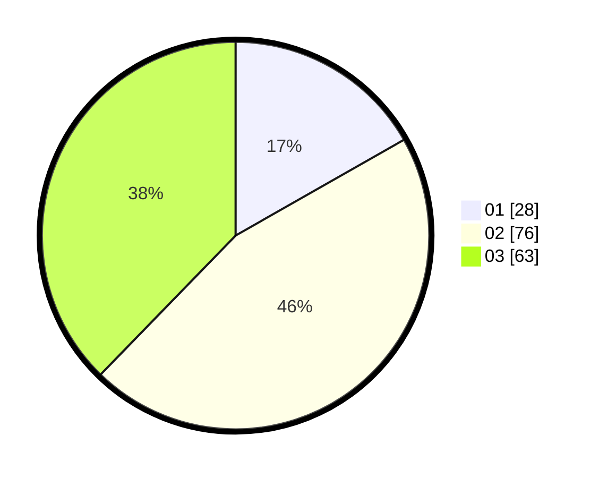

# Hasil

Hasil perolehan suara paslon dapat dilihat pada file paslon-01.txt, paslon-02.txt, dan paslon-03.txt.

Jika tidak ada, artinya data tersebut belum ada pada SIREKAP.

## Perolehan Suara

 * Paslon 01: **28**.
 * Paslon 02: **76**.
 * Paslon 03: **63**.

## Foto C Plano

https://sirekap-obj-formc.kpu.go.id/5228/pemilu/ppwp/31/71/02/10/05/3171021005094-20240215-112449--fb1bbf37-1f4b-4c49-bc1a-cc4fb5c06d98.jpg

https://sirekap-obj-formc.kpu.go.id/5228/pemilu/ppwp/31/71/02/10/05/3171021005094-20240215-112959--21d1e44a-0bd1-46d6-8e30-c5b58c9a5608.jpg

https://sirekap-obj-formc.kpu.go.id/5228/pemilu/ppwp/31/71/02/10/05/3171021005094-20240215-113104--49ef0cd8-6a54-4105-ad90-663b85ff684d.jpg

## DATA PEMILIH TETAP

Jumlah pemilih dalam DPT: **287**.
 * L: **146**.
 * P: **141**.

## DATA PENGGUNA HAK PILIH

Jumlah pengguna hak pilih dalam DPT: **166**.
 * L: **76**.
 * P: **90**.

Jumlah pengguna hak pilih dalam DPTb: **1**.
 * L: **1**.
 * P: **0**.

Jumlah pengguna hak pilih dalam DPK: **6**.
 * L: **3**.
 * P: **3**.

Jumlah pengguna hak pilih: **173**.
 * L: **80**.
 * P: **93**.

## JUMLAH SUARA SAH DAN TIDAK SAH

JUMLAH SELURUH SUARA SAH: **167**.

JUMLAH SUARA TIDAK SAH: **6**.

JUMLAH SELURUH SUARA SAH DAN SUARA TIDAK SAH: **173**.
