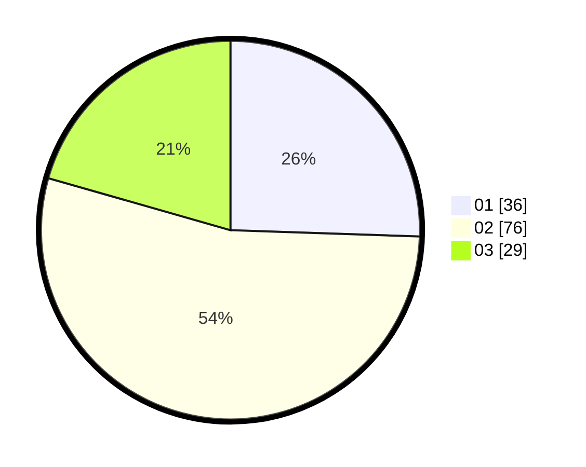

# Hasil

Hasil perolehan suara paslon dapat dilihat pada file paslon-01.txt, paslon-02.txt, dan paslon-03.txt.

Jika tidak ada, artinya data tersebut belum ada pada SIREKAP.

## Perolehan Suara

 * Paslon 01: **36**.
 * Paslon 02: **76**.
 * Paslon 03: **29**.

## Foto C Plano

https://sirekap-obj-formc.kpu.go.id/b5b7/pemilu/ppwp/31/71/02/10/05/3171021005096-20240214-230946--c540c5d7-2020-4c49-926d-1edc5187ff2e.jpg

https://sirekap-obj-formc.kpu.go.id/b5b7/pemilu/ppwp/31/71/02/10/05/3171021005096-20240214-231133--62117f76-f164-4e73-b0fb-58a8f5bd622d.jpg

https://sirekap-obj-formc.kpu.go.id/b5b7/pemilu/ppwp/31/71/02/10/05/3171021005096-20240214-231258--526166e4-c46a-48f8-ba12-e93d7bac0243.jpg

## DATA PEMILIH TETAP

Jumlah pemilih dalam DPT: **277**.
 * L: **159**.
 * P: **118**.

## DATA PENGGUNA HAK PILIH

Jumlah pengguna hak pilih dalam DPT: **126**.
 * L: **66**.
 * P: **60**.

Jumlah pengguna hak pilih dalam DPTb: **12**.
 * L: **5**.
 * P: **7**.

Jumlah pengguna hak pilih dalam DPK: **5**.
 * L: **3**.
 * P: **2**.

Jumlah pengguna hak pilih: **143**.
 * L: **74**.
 * P: **69**.

## JUMLAH SUARA SAH DAN TIDAK SAH

JUMLAH SELURUH SUARA SAH: **141**.

JUMLAH SUARA TIDAK SAH: **2**.

JUMLAH SELURUH SUARA SAH DAN SUARA TIDAK SAH: **143**.
