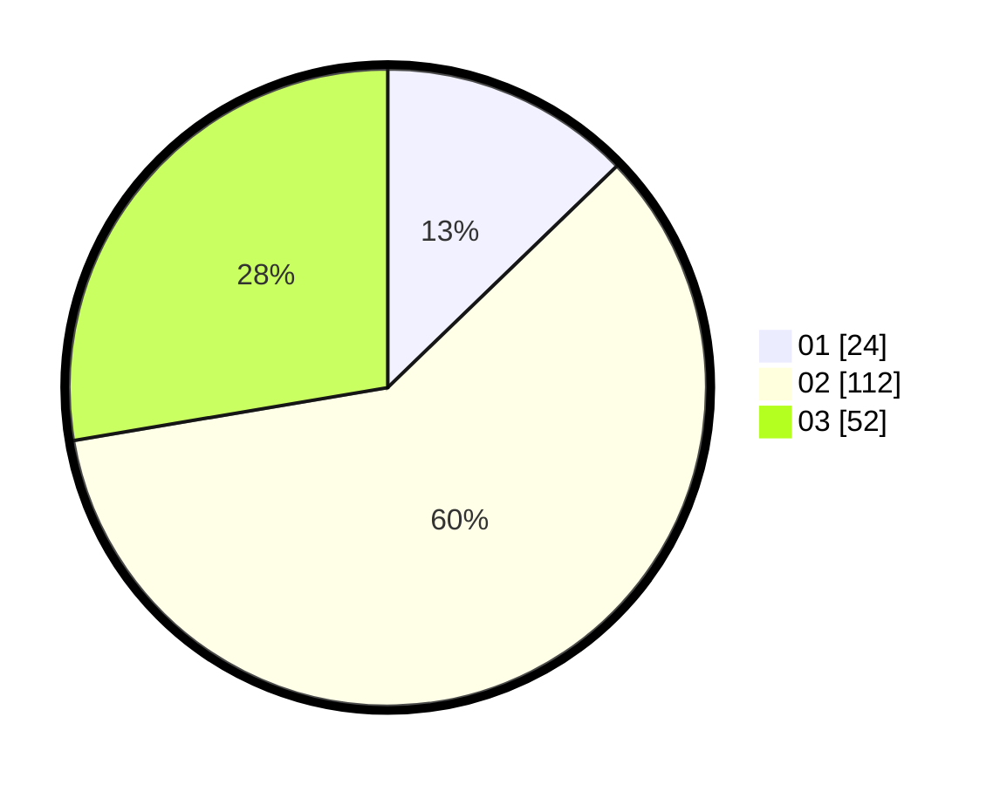

# Hasil

Hasil perolehan suara paslon dapat dilihat pada file paslon-01.txt, paslon-02.txt, dan paslon-03.txt.

Jika tidak ada, artinya data tersebut belum ada pada SIREKAP.

## Perolehan Suara

 * Paslon 01: **24**.
 * Paslon 02: **112**.
 * Paslon 03: **52**.

## Foto C Plano

https://sirekap-obj-formc.kpu.go.id/7127/pemilu/ppwp/31/71/03/10/01/3171031001004-20240215-205904--6556932a-96ef-4f9a-9d67-3a5b7b941cda.jpg

https://sirekap-obj-formc.kpu.go.id/7127/pemilu/ppwp/31/71/03/10/01/3171031001004-20240215-205906--63141f53-46cb-44b6-9df8-005f26ae55db.jpg

https://sirekap-obj-formc.kpu.go.id/7127/pemilu/ppwp/31/71/03/10/01/3171031001004-20240215-205904--866a9892-bc24-4c5b-a319-97cbbb34017f.jpg

## DATA PEMILIH TETAP

Jumlah pemilih dalam DPT: **278**.
 * L: **128**.
 * P: **150**.

## DATA PENGGUNA HAK PILIH

Jumlah pengguna hak pilih dalam DPT: **190**.
 * L: **86**.
 * P: **104**.

Jumlah pengguna hak pilih dalam DPTb: **0**.
 * L: **0**.
 * P: **0**.

Jumlah pengguna hak pilih dalam DPK: **3**.
 * L: **1**.
 * P: **2**.

Jumlah pengguna hak pilih: **193**.
 * L: **87**.
 * P: **106**.

## JUMLAH SUARA SAH DAN TIDAK SAH

JUMLAH SELURUH SUARA SAH: **188**.

JUMLAH SUARA TIDAK SAH: **5**.

JUMLAH SELURUH SUARA SAH DAN SUARA TIDAK SAH: **193**.
