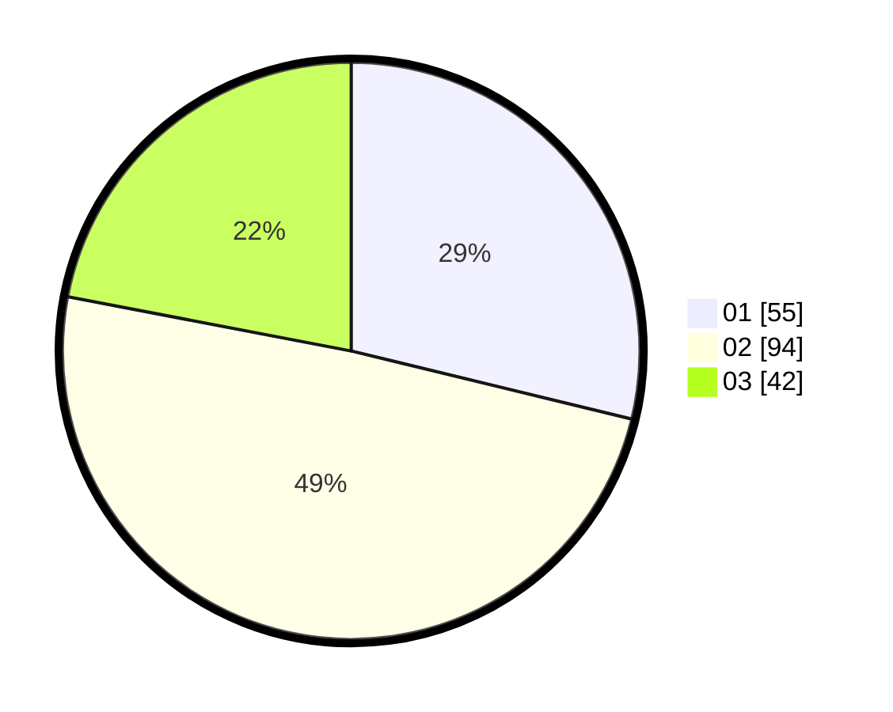

# Hasil

Hasil perolehan suara paslon dapat dilihat pada file paslon-01.txt, paslon-02.txt, dan paslon-03.txt.

Jika tidak ada, artinya data tersebut belum ada pada SIREKAP.

## Perolehan Suara

 * Paslon 01: **55**.
 * Paslon 02: **94**.
 * Paslon 03: **42**.

## Foto C Plano

https://sirekap-obj-formc.kpu.go.id/87df/pemilu/ppwp/31/71/03/10/01/3171031001011-20240214-191154--fa6c0b39-284e-44e6-95f7-7f5f3b34886c.jpg

https://sirekap-obj-formc.kpu.go.id/87df/pemilu/ppwp/31/71/03/10/01/3171031001011-20240214-190413--63daecf6-6399-4e71-9485-9807a3552ee2.jpg

https://sirekap-obj-formc.kpu.go.id/87df/pemilu/ppwp/31/71/03/10/01/3171031001011-20240214-191330--83b78b6c-e938-43c6-8a96-2a62661c87e1.jpg

## DATA PEMILIH TETAP

Jumlah pemilih dalam DPT: **258**.
 * L: **138**.
 * P: **120**.

## DATA PENGGUNA HAK PILIH

Jumlah pengguna hak pilih dalam DPT: **195**.
 * L: **99**.
 * P: **96**.

Jumlah pengguna hak pilih dalam DPTb: **1**.
 * L: **0**.
 * P: **1**.

Jumlah pengguna hak pilih dalam DPK: **1**.
 * L: **0**.
 * P: **1**.

Jumlah pengguna hak pilih: **197**.
 * L: **99**.
 * P: **98**.

## JUMLAH SUARA SAH DAN TIDAK SAH

JUMLAH SELURUH SUARA SAH: **191**.

JUMLAH SUARA TIDAK SAH: **6**.

JUMLAH SELURUH SUARA SAH DAN SUARA TIDAK SAH: **197**.
