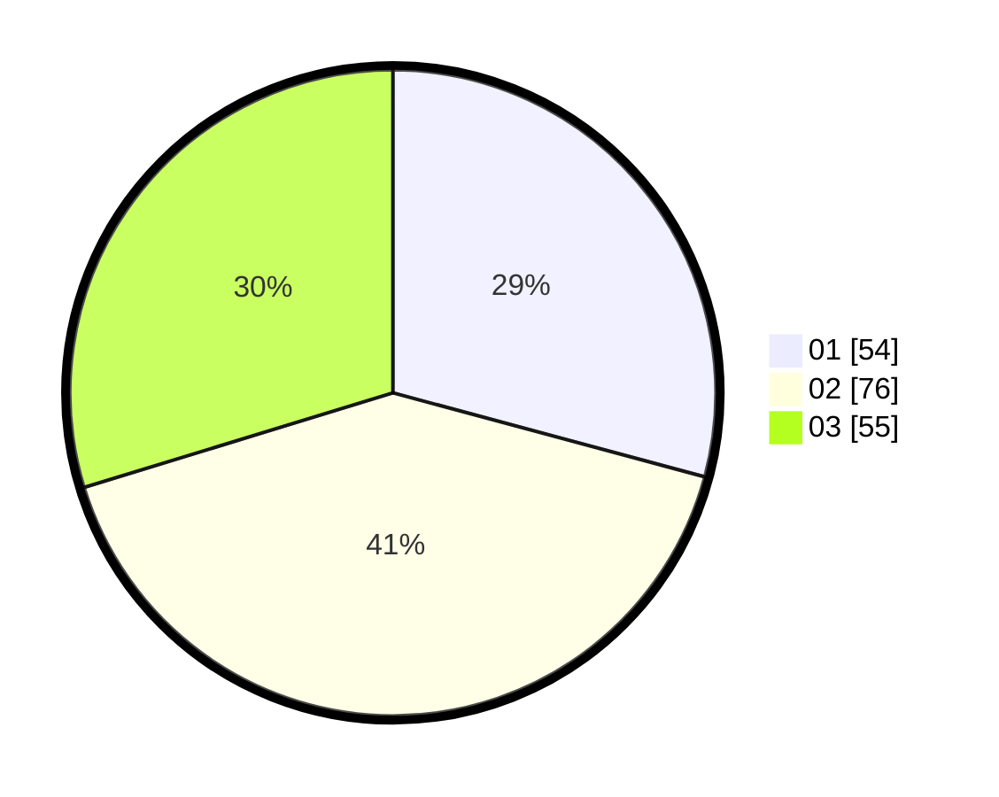

# Hasil

Hasil perolehan suara paslon dapat dilihat pada file paslon-01.txt, paslon-02.txt, dan paslon-03.txt.

Jika tidak ada, artinya data tersebut belum ada pada SIREKAP.

## Perolehan Suara

 * Paslon 01: **54**.
 * Paslon 02: **76**.
 * Paslon 03: **55**.

## Foto C Plano

https://sirekap-obj-formc.kpu.go.id/de24/pemilu/ppwp/31/71/03/10/01/3171031001014-20240217-094807--7fb0a168-a861-4020-a4ba-0e5b7a71cc02.jpg

https://sirekap-obj-formc.kpu.go.id/de24/pemilu/ppwp/31/71/03/10/01/3171031001014-20240217-094808--a2859490-36e7-4f73-b36d-5cc5eef30baf.jpg

https://sirekap-obj-formc.kpu.go.id/de24/pemilu/ppwp/31/71/03/10/01/3171031001014-20240217-094808--ba2fd1a1-5491-4275-b840-d676a1ec847c.jpg

## DATA PEMILIH TETAP

Jumlah pemilih dalam DPT: **239**.
 * L: **119**.
 * P: **120**.

## DATA PENGGUNA HAK PILIH

Jumlah pengguna hak pilih dalam DPT: **174**.
 * L: **90**.
 * P: **84**.

Jumlah pengguna hak pilih dalam DPTb: **12**.
 * L: **7**.
 * P: **5**.

Jumlah pengguna hak pilih dalam DPK: **1**.
 * L: **0**.
 * P: **1**.

Jumlah pengguna hak pilih: **187**.
 * L: **97**.
 * P: **90**.

## JUMLAH SUARA SAH DAN TIDAK SAH

JUMLAH SELURUH SUARA SAH: **185**.

JUMLAH SUARA TIDAK SAH: **2**.

JUMLAH SELURUH SUARA SAH DAN SUARA TIDAK SAH: **187**.
