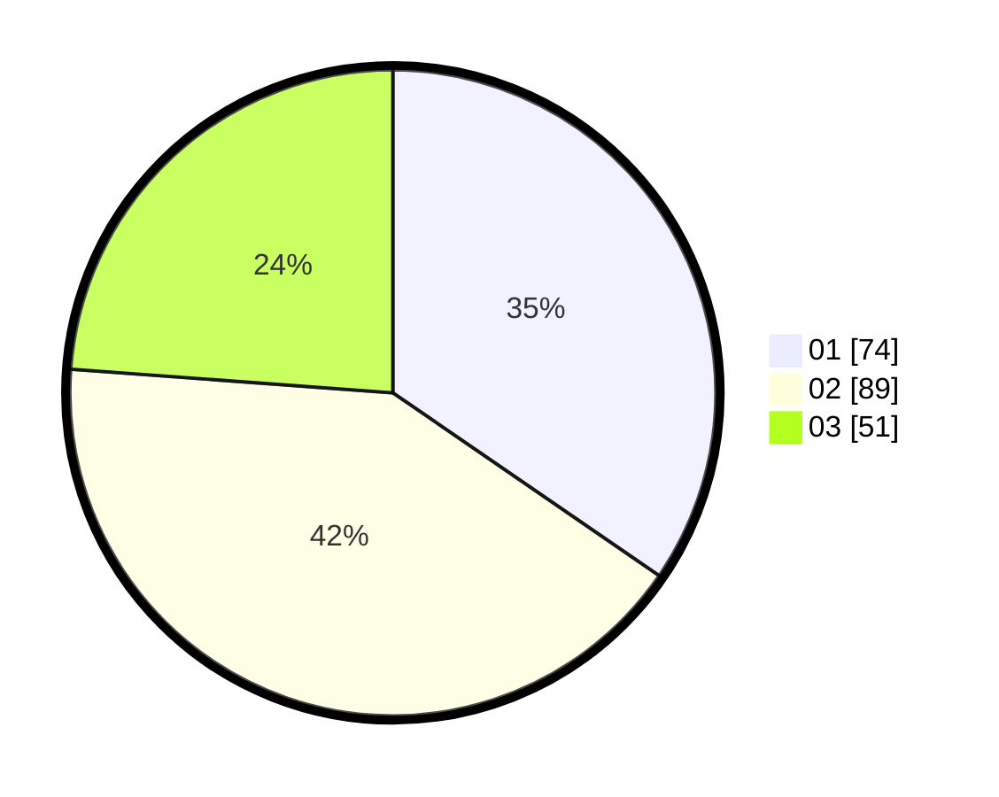

# Hasil

Hasil perolehan suara paslon dapat dilihat pada file paslon-01.txt, paslon-02.txt, dan paslon-03.txt.

Jika tidak ada, artinya data tersebut belum ada pada SIREKAP.

## Perolehan Suara

 * Paslon 01: **74**.
 * Paslon 02: **89**.
 * Paslon 03: **51**.

## Foto C Plano

https://sirekap-obj-formc.kpu.go.id/e981/pemilu/ppwp/31/71/03/10/01/3171031001017-20240215-032001--20fd9409-924e-4954-a3f7-1d69c3dcd3b9.jpg

https://sirekap-obj-formc.kpu.go.id/e981/pemilu/ppwp/31/71/03/10/01/3171031001017-20240215-032230--f1905367-eba9-4030-9976-19c1dcfda9db.jpg

https://sirekap-obj-formc.kpu.go.id/e981/pemilu/ppwp/31/71/03/10/01/3171031001017-20240214-191712--de8a1663-8ca1-4bfb-9362-e8c9d713fec9.jpg

## DATA PEMILIH TETAP

Jumlah pemilih dalam DPT: **291**.
 * L: **133**.
 * P: **158**.

## DATA PENGGUNA HAK PILIH

Jumlah pengguna hak pilih dalam DPT: **289**.
 * L: **133**.
 * P: **156**.

Jumlah pengguna hak pilih dalam DPTb: **0**.
 * L: **0**.
 * P: **0**.

Jumlah pengguna hak pilih dalam DPK: **2**.
 * L: **0**.
 * P: **2**.

Jumlah pengguna hak pilih: **291**.
 * L: **133**.
 * P: **158**.

## JUMLAH SUARA SAH DAN TIDAK SAH

JUMLAH SELURUH SUARA SAH: **214**.

JUMLAH SUARA TIDAK SAH: **2**.

JUMLAH SELURUH SUARA SAH DAN SUARA TIDAK SAH: **216**.
