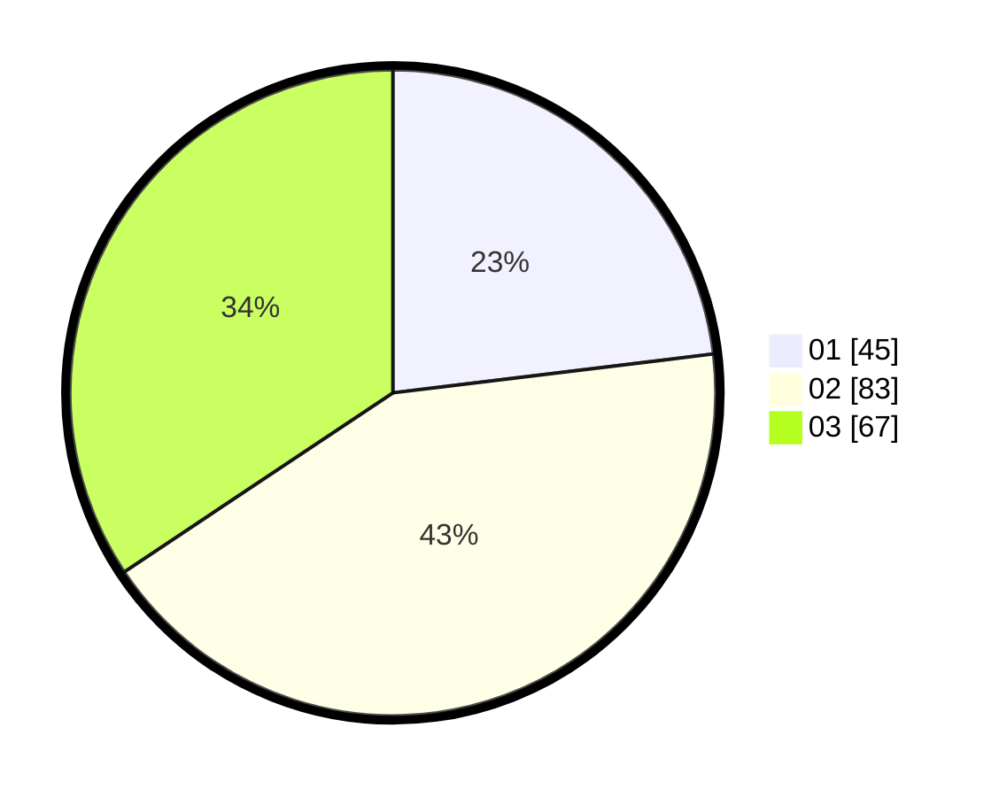

# Hasil

Hasil perolehan suara paslon dapat dilihat pada file paslon-01.txt, paslon-02.txt, dan paslon-03.txt.

Jika tidak ada, artinya data tersebut belum ada pada SIREKAP.

## Perolehan Suara

 * Paslon 01: **45**.
 * Paslon 02: **83**.
 * Paslon 03: **67**.

## Foto C Plano

https://sirekap-obj-formc.kpu.go.id/f6b7/pemilu/ppwp/31/71/03/10/01/3171031001023-20240215-224448--20da1369-e540-4d69-95ff-bd253ab10157.jpg

https://sirekap-obj-formc.kpu.go.id/f6b7/pemilu/ppwp/31/71/03/10/01/3171031001023-20240215-224451--df9438c4-dd1c-4d53-9b84-f3d8908d9d97.jpg

https://sirekap-obj-formc.kpu.go.id/f6b7/pemilu/ppwp/31/71/03/10/01/3171031001023-20240215-224449--575c2edc-3ad0-428f-80c6-f34c898c857f.jpg

## DATA PEMILIH TETAP

Jumlah pemilih dalam DPT: **262**.
 * L: **127**.
 * P: **135**.

## DATA PENGGUNA HAK PILIH

Jumlah pengguna hak pilih dalam DPT: **195**.
 * L: **94**.
 * P: **101**.

Jumlah pengguna hak pilih dalam DPTb: **4**.
 * L: **2**.
 * P: **2**.

Jumlah pengguna hak pilih dalam DPK: **1**.
 * L: **1**.
 * P: **0**.

Jumlah pengguna hak pilih: **200**.
 * L: **97**.
 * P: **103**.

## JUMLAH SUARA SAH DAN TIDAK SAH

JUMLAH SELURUH SUARA SAH: **195**.

JUMLAH SUARA TIDAK SAH: **5**.

JUMLAH SELURUH SUARA SAH DAN SUARA TIDAK SAH: **200**.
