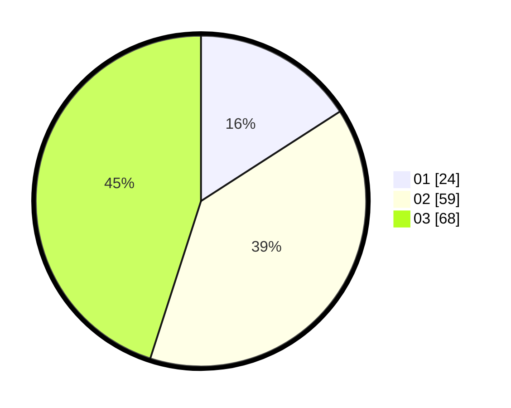

# Hasil

Hasil perolehan suara paslon dapat dilihat pada file paslon-01.txt, paslon-02.txt, dan paslon-03.txt.

Jika tidak ada, artinya data tersebut belum ada pada SIREKAP.

## Perolehan Suara

 * Paslon 01: **24**.
 * Paslon 02: **59**.
 * Paslon 03: **68**.

## Foto C Plano

https://sirekap-obj-formc.kpu.go.id/0616/pemilu/ppwp/31/71/03/10/01/3171031001024-20240214-155437--8a6eace4-711e-43f6-be7f-c46e40bae055.jpg

https://sirekap-obj-formc.kpu.go.id/0616/pemilu/ppwp/31/71/03/10/01/3171031001024-20240214-155300--d83961be-cef7-4431-ba4c-29a412784832.jpg

https://sirekap-obj-formc.kpu.go.id/0616/pemilu/ppwp/31/71/03/10/01/3171031001024-20240214-155557--316c3a84-bbc2-4cda-a7ce-5af9e8364afb.jpg

## DATA PEMILIH TETAP

Jumlah pemilih dalam DPT: **209**.
 * L: **105**.
 * P: **104**.

## DATA PENGGUNA HAK PILIH

Jumlah pengguna hak pilih dalam DPT: **150**.
 * L: **76**.
 * P: **74**.

Jumlah pengguna hak pilih dalam DPTb: **0**.
 * L: **0**.
 * P: **0**.

Jumlah pengguna hak pilih dalam DPK: **0**.
 * L: **0**.
 * P: **0**.

Jumlah pengguna hak pilih: **153**.
 * L: **76**.
 * P: **77**.

## JUMLAH SUARA SAH DAN TIDAK SAH

JUMLAH SELURUH SUARA SAH: **151**.

JUMLAH SUARA TIDAK SAH: **2**.

JUMLAH SELURUH SUARA SAH DAN SUARA TIDAK SAH: **153**.
