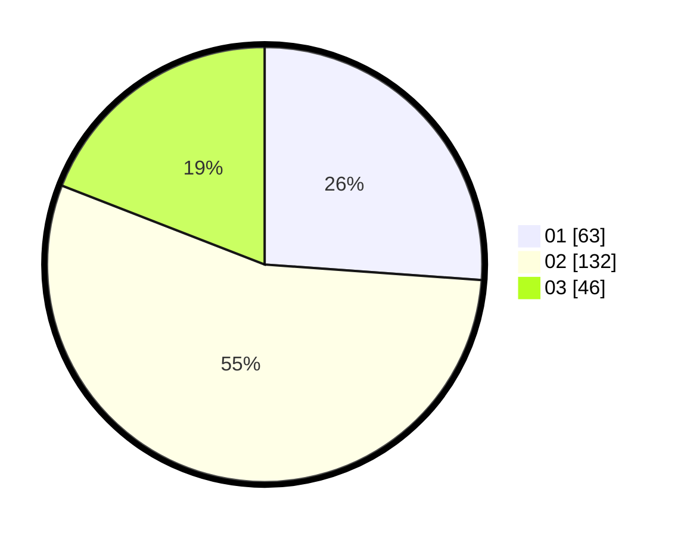

# Hasil

Hasil perolehan suara paslon dapat dilihat pada file paslon-01.txt, paslon-02.txt, dan paslon-03.txt.

Jika tidak ada, artinya data tersebut belum ada pada SIREKAP.

## Perolehan Suara

 * Paslon 01: **63**.
 * Paslon 02: **132**.
 * Paslon 03: **46**.

## Foto C Plano

https://sirekap-obj-formc.kpu.go.id/fc04/pemilu/ppwp/31/71/03/10/01/3171031001026-20240217-182038--95fb62ca-6838-46d5-9dad-e5070fd87f7b.jpg

https://sirekap-obj-formc.kpu.go.id/fc04/pemilu/ppwp/31/71/03/10/01/3171031001026-20240217-182040--44ab4a52-1551-449c-83f4-5a65554770cb.jpg

https://sirekap-obj-formc.kpu.go.id/fc04/pemilu/ppwp/31/71/03/10/01/3171031001026-20240217-182039--b6f5a478-188d-44c9-8287-ffe3e02b6b2c.jpg

## DATA PEMILIH TETAP

Jumlah pemilih dalam DPT: **265**.
 * L: **132**.
 * P: **133**.

## DATA PENGGUNA HAK PILIH

Jumlah pengguna hak pilih dalam DPT: **230**.
 * L: **115**.
 * P: **115**.

Jumlah pengguna hak pilih dalam DPTb: **13**.
 * L: **8**.
 * P: **5**.

Jumlah pengguna hak pilih dalam DPK: **0**.
 * L: **0**.
 * P: **0**.

Jumlah pengguna hak pilih: **243**.
 * L: **123**.
 * P: **120**.

## JUMLAH SUARA SAH DAN TIDAK SAH

JUMLAH SELURUH SUARA SAH: **241**.

JUMLAH SUARA TIDAK SAH: **2**.

JUMLAH SELURUH SUARA SAH DAN SUARA TIDAK SAH: **243**.
