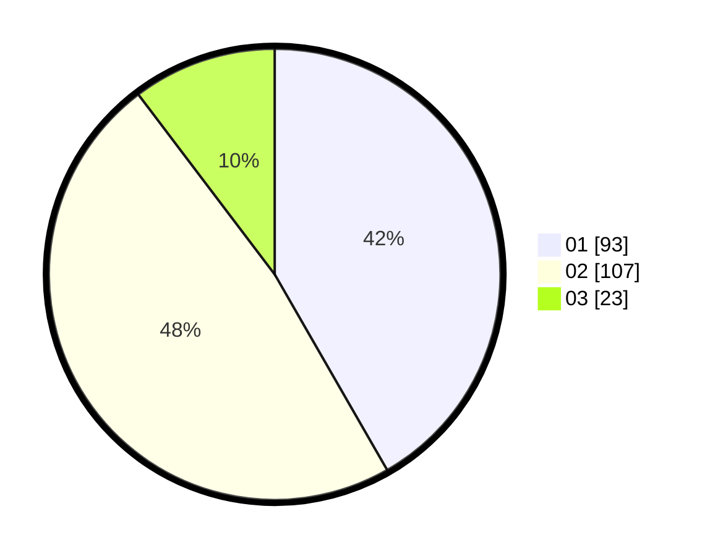

# Hasil

Hasil perolehan suara paslon dapat dilihat pada file paslon-01.txt, paslon-02.txt, dan paslon-03.txt.

Jika tidak ada, artinya data tersebut belum ada pada SIREKAP.

## Perolehan Suara

 * Paslon 01: **93**.
 * Paslon 02: **107**.
 * Paslon 03: **23**.

## Foto C Plano

https://sirekap-obj-formc.kpu.go.id/9836/pemilu/ppwp/31/71/03/10/01/3171031001034-20240216-115611--80bd3ea3-e390-482d-b332-164c8dd98cf7.jpg

https://sirekap-obj-formc.kpu.go.id/9836/pemilu/ppwp/31/71/03/10/01/3171031001034-20240216-115616--4edc12a3-60a7-472d-8c91-14a41ccbdae2.jpg

https://sirekap-obj-formc.kpu.go.id/9836/pemilu/ppwp/31/71/03/10/01/3171031001034-20240216-115613--f92d4793-31ff-4926-8801-4845e9d9fc65.jpg

## DATA PEMILIH TETAP

Jumlah pemilih dalam DPT: **294**.
 * L: **150**.
 * P: **144**.

## DATA PENGGUNA HAK PILIH

Jumlah pengguna hak pilih dalam DPT: **227**.
 * L: **117**.
 * P: **110**.

Jumlah pengguna hak pilih dalam DPTb: **1**.
 * L: **0**.
 * P: **1**.

Jumlah pengguna hak pilih dalam DPK: **0**.
 * L: **0**.
 * P: **0**.

Jumlah pengguna hak pilih: **228**.
 * L: **117**.
 * P: **111**.

## JUMLAH SUARA SAH DAN TIDAK SAH

JUMLAH SELURUH SUARA SAH: **223**.

JUMLAH SUARA TIDAK SAH: **5**.

JUMLAH SELURUH SUARA SAH DAN SUARA TIDAK SAH: **228**.
