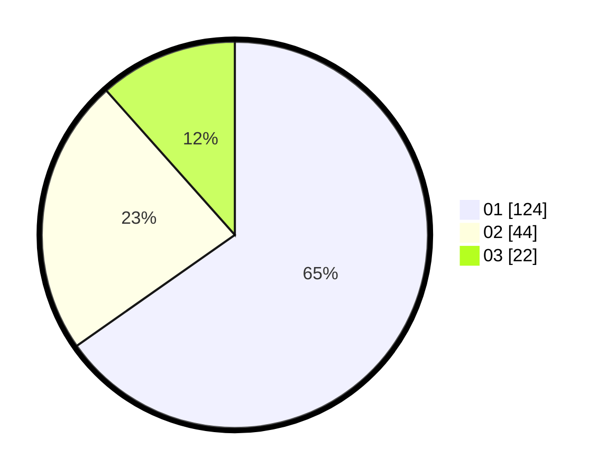

# Hasil

Hasil perolehan suara paslon dapat dilihat pada file paslon-01.txt, paslon-02.txt, dan paslon-03.txt.

Jika tidak ada, artinya data tersebut belum ada pada SIREKAP.

## Perolehan Suara

 * Paslon 01: **124**.
 * Paslon 02: **44**.
 * Paslon 03: **22**.

## Foto C Plano

https://sirekap-obj-formc.kpu.go.id/5ea2/pemilu/ppwp/31/71/03/10/01/3171031001038-20240216-153603--11d14713-e0e6-49ca-8d4e-4d47f371b237.jpg

https://sirekap-obj-formc.kpu.go.id/5ea2/pemilu/ppwp/31/71/03/10/01/3171031001038-20240216-153025--eb8f1055-3f41-4278-8270-4b936870ce8f.jpg

https://sirekap-obj-formc.kpu.go.id/5ea2/pemilu/ppwp/31/71/03/10/01/3171031001038-20240216-152457--0165eca9-13aa-48c7-814a-4919a07d68ed.jpg

## DATA PEMILIH TETAP

Jumlah pemilih dalam DPT: **273**.
 * L: **125**.
 * P: **148**.

## DATA PENGGUNA HAK PILIH

Jumlah pengguna hak pilih dalam DPT: **230**.
 * L: **107**.
 * P: **123**.

Jumlah pengguna hak pilih dalam DPTb: **1**.
 * L: **0**.
 * P: **1**.

Jumlah pengguna hak pilih dalam DPK: **0**.
 * L: **0**.
 * P: **0**.

Jumlah pengguna hak pilih: **231**.
 * L: **107**.
 * P: **124**.

## JUMLAH SUARA SAH DAN TIDAK SAH

JUMLAH SELURUH SUARA SAH: **231**.

JUMLAH SUARA TIDAK SAH: **2**.

JUMLAH SELURUH SUARA SAH DAN SUARA TIDAK SAH: **233**.
