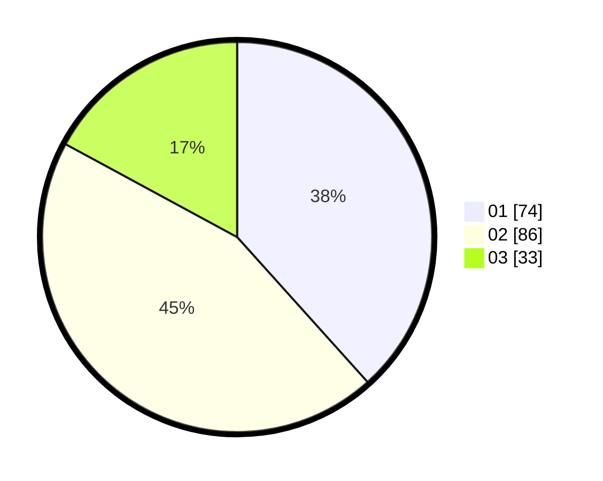

# Hasil

Hasil perolehan suara paslon dapat dilihat pada file paslon-01.txt, paslon-02.txt, dan paslon-03.txt.

Jika tidak ada, artinya data tersebut belum ada pada SIREKAP.

## Perolehan Suara

 * Paslon 01: **74**.
 * Paslon 02: **86**.
 * Paslon 03: **33**.

## Foto C Plano

https://sirekap-obj-formc.kpu.go.id/0d67/pemilu/ppwp/31/71/03/10/01/3171031001040-20240214-231028--3ae92438-351b-4c97-8d4b-d2469ba68ed7.jpg

https://sirekap-obj-formc.kpu.go.id/0d67/pemilu/ppwp/31/71/03/10/01/3171031001040-20240214-232213--28e0993a-b432-477b-b6dd-700bc9d6f0df.jpg

https://sirekap-obj-formc.kpu.go.id/0d67/pemilu/ppwp/31/71/03/10/01/3171031001040-20240214-232448--326d8171-a84d-4a0b-b1e5-707dd4f30c05.jpg

## DATA PEMILIH TETAP

Jumlah pemilih dalam DPT: **281**.
 * L: **155**.
 * P: **126**.

## DATA PENGGUNA HAK PILIH

Jumlah pengguna hak pilih dalam DPT: **189**.
 * L: **106**.
 * P: **83**.

Jumlah pengguna hak pilih dalam DPTb: **3**.
 * L: **2**.
 * P: **1**.

Jumlah pengguna hak pilih dalam DPK: **2**.
 * L: **2**.
 * P: **0**.

Jumlah pengguna hak pilih: **194**.
 * L: **110**.
 * P: **84**.

## JUMLAH SUARA SAH DAN TIDAK SAH

JUMLAH SELURUH SUARA SAH: **193**.

JUMLAH SUARA TIDAK SAH: **1**.

JUMLAH SELURUH SUARA SAH DAN SUARA TIDAK SAH: **194**.
