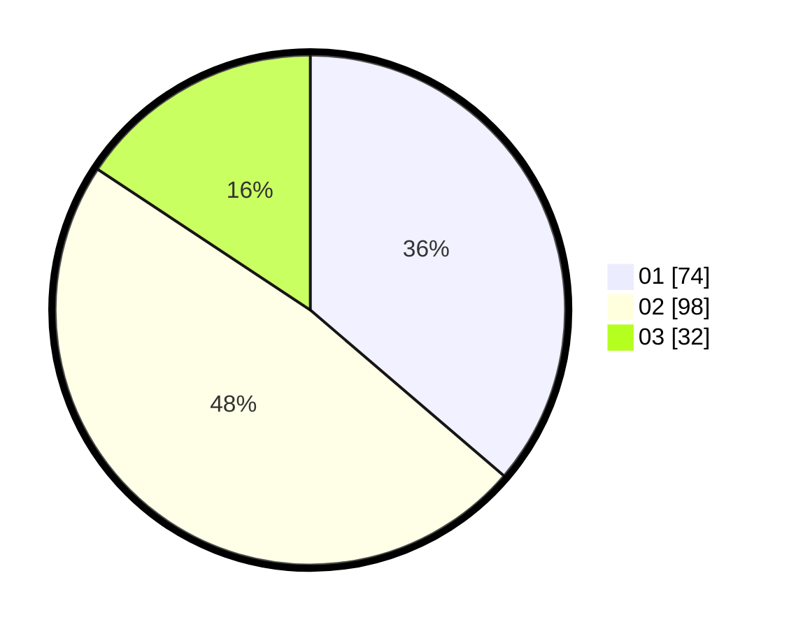

# Hasil

Hasil perolehan suara paslon dapat dilihat pada file paslon-01.txt, paslon-02.txt, dan paslon-03.txt.

Jika tidak ada, artinya data tersebut belum ada pada SIREKAP.

## Perolehan Suara

 * Paslon 01: **74**.
 * Paslon 02: **98**.
 * Paslon 03: **32**.

## Foto C Plano

https://sirekap-obj-formc.kpu.go.id/aa1e/pemilu/ppwp/31/71/03/10/01/3171031001041-20240216-132702--60917e48-a71e-44e4-8393-a4e5c25e4358.jpg

https://sirekap-obj-formc.kpu.go.id/aa1e/pemilu/ppwp/31/71/03/10/01/3171031001041-20240216-132703--d1f66b5a-c7e8-40cd-8ab0-179f3289b115.jpg

https://sirekap-obj-formc.kpu.go.id/aa1e/pemilu/ppwp/31/71/03/10/01/3171031001041-20240216-132702--e7c010bc-85fb-455a-8829-5ce22e3b322e.jpg

## DATA PEMILIH TETAP

Jumlah pemilih dalam DPT: **290**.
 * L: **140**.
 * P: **150**.

## DATA PENGGUNA HAK PILIH

Jumlah pengguna hak pilih dalam DPT: **197**.
 * L: **96**.
 * P: **101**.

Jumlah pengguna hak pilih dalam DPTb: **10**.
 * L: **8**.
 * P: **2**.

Jumlah pengguna hak pilih dalam DPK: **3**.
 * L: **3**.
 * P: **0**.

Jumlah pengguna hak pilih: **210**.
 * L: **107**.
 * P: **103**.

## JUMLAH SUARA SAH DAN TIDAK SAH

JUMLAH SELURUH SUARA SAH: **204**.

JUMLAH SUARA TIDAK SAH: **6**.

JUMLAH SELURUH SUARA SAH DAN SUARA TIDAK SAH: **210**.
