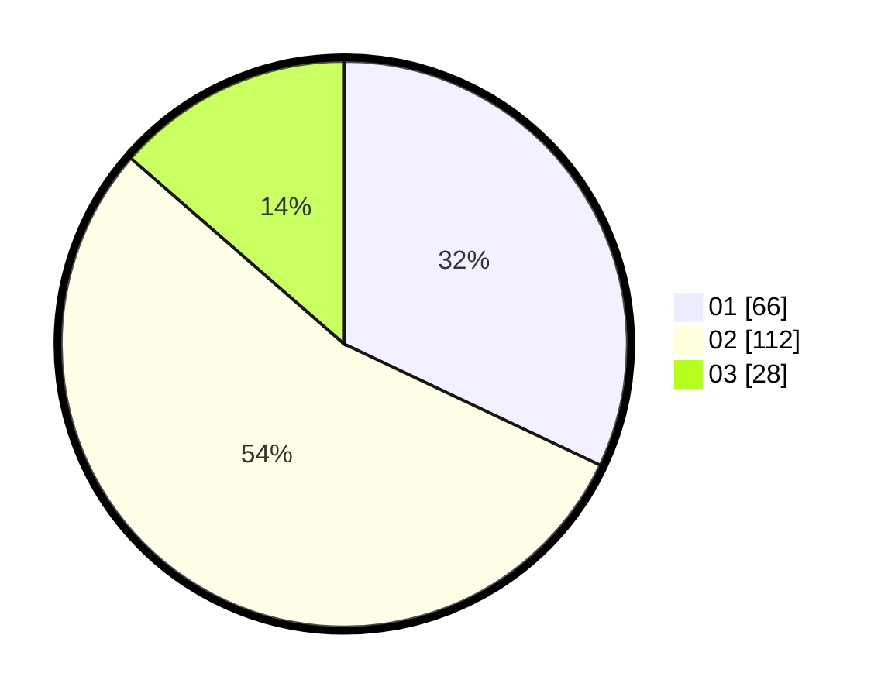

# Hasil

Hasil perolehan suara paslon dapat dilihat pada file paslon-01.txt, paslon-02.txt, dan paslon-03.txt.

Jika tidak ada, artinya data tersebut belum ada pada SIREKAP.

## Perolehan Suara

 * Paslon 01: **66**.
 * Paslon 02: **112**.
 * Paslon 03: **28**.

## Foto C Plano

https://sirekap-obj-formc.kpu.go.id/c284/pemilu/ppwp/31/71/03/10/01/3171031001043-20240214-155658--bd495e37-db7f-4001-9d2d-f4308b756055.jpg

https://sirekap-obj-formc.kpu.go.id/c284/pemilu/ppwp/31/71/03/10/01/3171031001043-20240214-160121--31770bd7-2555-41af-8850-99fe00512730.jpg

https://sirekap-obj-formc.kpu.go.id/c284/pemilu/ppwp/31/71/03/10/01/3171031001043-20240214-155922--98ab65bd-42ce-4d18-8391-8d4881a4f14d.jpg

## DATA PEMILIH TETAP

Jumlah pemilih dalam DPT: **260**.
 * L: **133**.
 * P: **127**.

## DATA PENGGUNA HAK PILIH

Jumlah pengguna hak pilih dalam DPT: **201**.
 * L: **104**.
 * P: **97**.

Jumlah pengguna hak pilih dalam DPTb: **6**.
 * L: **3**.
 * P: **3**.

Jumlah pengguna hak pilih dalam DPK: **4**.
 * L: **2**.
 * P: **2**.

Jumlah pengguna hak pilih: **211**.
 * L: **109**.
 * P: **102**.

## JUMLAH SUARA SAH DAN TIDAK SAH

JUMLAH SELURUH SUARA SAH: **206**.

JUMLAH SUARA TIDAK SAH: **5**.

JUMLAH SELURUH SUARA SAH DAN SUARA TIDAK SAH: **211**.
