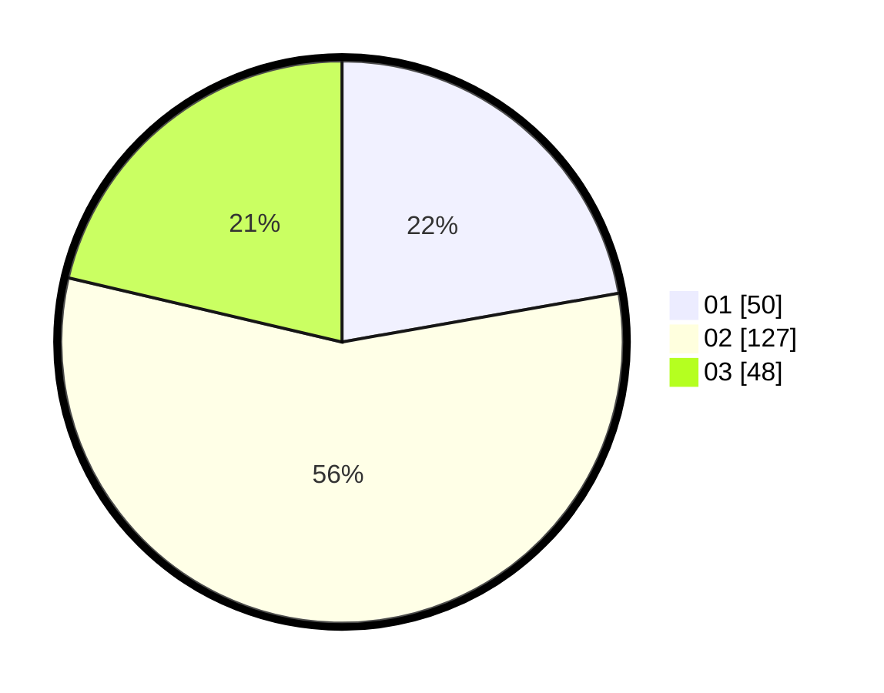

# Hasil

Hasil perolehan suara paslon dapat dilihat pada file paslon-01.txt, paslon-02.txt, dan paslon-03.txt.

Jika tidak ada, artinya data tersebut belum ada pada SIREKAP.

## Perolehan Suara

 * Paslon 01: **50**.
 * Paslon 02: **127**.
 * Paslon 03: **48**.

## Foto C Plano

https://sirekap-obj-formc.kpu.go.id/904b/pemilu/ppwp/31/71/03/10/01/3171031001044-20240214-194144--5486d74d-5cfc-433d-a7ba-29ff8b879e96.jpg

https://sirekap-obj-formc.kpu.go.id/904b/pemilu/ppwp/31/71/03/10/01/3171031001044-20240214-192434--b58d7f9c-108d-4e5c-9bda-c9ed399a1f6b.jpg

https://sirekap-obj-formc.kpu.go.id/904b/pemilu/ppwp/31/71/03/10/01/3171031001044-20240214-220144--0c4ee823-4067-4cc8-8b58-5e2f661d76de.jpg

## DATA PEMILIH TETAP

Jumlah pemilih dalam DPT: **287**.
 * L: **133**.
 * P: **154**.

## DATA PENGGUNA HAK PILIH

Jumlah pengguna hak pilih dalam DPT: **211**.
 * L: **104**.
 * P: **107**.

Jumlah pengguna hak pilih dalam DPTb: **16**.
 * L: **9**.
 * P: **7**.

Jumlah pengguna hak pilih dalam DPK: **3**.
 * L: **2**.
 * P: **1**.

Jumlah pengguna hak pilih: **230**.
 * L: **115**.
 * P: **115**.

## JUMLAH SUARA SAH DAN TIDAK SAH

JUMLAH SELURUH SUARA SAH: **225**.

JUMLAH SUARA TIDAK SAH: **5**.

JUMLAH SELURUH SUARA SAH DAN SUARA TIDAK SAH: **230**.
