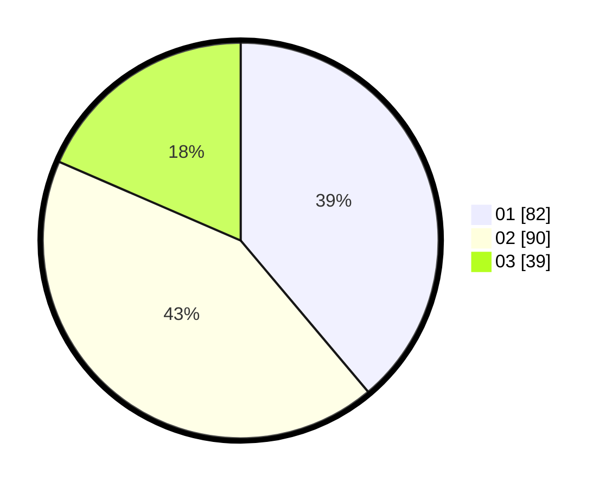

# Hasil

Hasil perolehan suara paslon dapat dilihat pada file paslon-01.txt, paslon-02.txt, dan paslon-03.txt.

Jika tidak ada, artinya data tersebut belum ada pada SIREKAP.

## Perolehan Suara

 * Paslon 01: **82**.
 * Paslon 02: **90**.
 * Paslon 03: **39**.

## Foto C Plano

https://sirekap-obj-formc.kpu.go.id/7ad5/pemilu/ppwp/31/71/03/10/01/3171031001049-20240214-204729--37ff4e80-8ccb-4772-a8e8-ec1b1d5f274f.jpg

https://sirekap-obj-formc.kpu.go.id/7ad5/pemilu/ppwp/31/71/03/10/01/3171031001049-20240217-123752--78a42d2b-8945-44b6-b279-015be9ffcd10.jpg

https://sirekap-obj-formc.kpu.go.id/7ad5/pemilu/ppwp/31/71/03/10/01/3171031001049-20240215-151543--e39df53d-a6e8-4ef6-90b6-54da1bea71aa.jpg

## DATA PEMILIH TETAP

Jumlah pemilih dalam DPT: **289**.
 * L: **140**.
 * P: **149**.

## DATA PENGGUNA HAK PILIH

Jumlah pengguna hak pilih dalam DPT: **208**.
 * L: **92**.
 * P: **116**.

Jumlah pengguna hak pilih dalam DPTb: **2**.
 * L: **1**.
 * P: **1**.

Jumlah pengguna hak pilih dalam DPK: **2**.
 * L: **2**.
 * P: **0**.

Jumlah pengguna hak pilih: **212**.
 * L: **95**.
 * P: **117**.

## JUMLAH SUARA SAH DAN TIDAK SAH

JUMLAH SELURUH SUARA SAH: **211**.

JUMLAH SUARA TIDAK SAH: **1**.

JUMLAH SELURUH SUARA SAH DAN SUARA TIDAK SAH: **212**.
