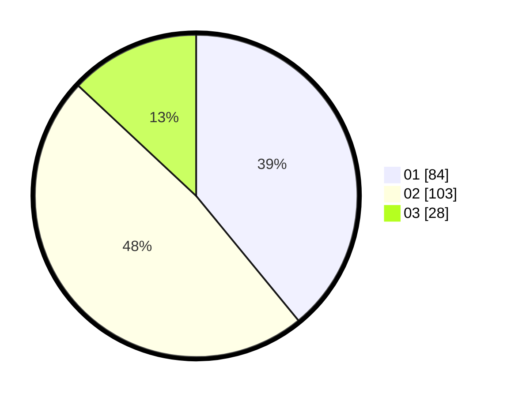

# Hasil

Hasil perolehan suara paslon dapat dilihat pada file paslon-01.txt, paslon-02.txt, dan paslon-03.txt.

Jika tidak ada, artinya data tersebut belum ada pada SIREKAP.

## Perolehan Suara

 * Paslon 01: **84**.
 * Paslon 02: **103**.
 * Paslon 03: **28**.

## Foto C Plano

https://sirekap-obj-formc.kpu.go.id/1543/pemilu/ppwp/31/71/03/10/01/3171031001052-20240215-113748--8b850b44-e65a-4430-aa7f-940c106fe44f.jpg

https://sirekap-obj-formc.kpu.go.id/1543/pemilu/ppwp/31/71/03/10/01/3171031001052-20240215-113846--1acabcc1-9aca-4204-ae2a-515f72982db6.jpg

https://sirekap-obj-formc.kpu.go.id/1543/pemilu/ppwp/31/71/03/10/01/3171031001052-20240215-113948--7b4c7b33-eb39-4cc0-85b3-935087c2195d.jpg

## DATA PEMILIH TETAP

Jumlah pemilih dalam DPT: **276**.
 * L: **142**.
 * P: **134**.

## DATA PENGGUNA HAK PILIH

Jumlah pengguna hak pilih dalam DPT: **221**.
 * L: **110**.
 * P: **111**.

Jumlah pengguna hak pilih dalam DPTb: **0**.
 * L: **0**.
 * P: **0**.

Jumlah pengguna hak pilih dalam DPK: **0**.
 * L: **0**.
 * P: **0**.

Jumlah pengguna hak pilih: **221**.
 * L: **110**.
 * P: **111**.

## JUMLAH SUARA SAH DAN TIDAK SAH

JUMLAH SELURUH SUARA SAH: **215**.

JUMLAH SUARA TIDAK SAH: **6**.

JUMLAH SELURUH SUARA SAH DAN SUARA TIDAK SAH: **221**.
