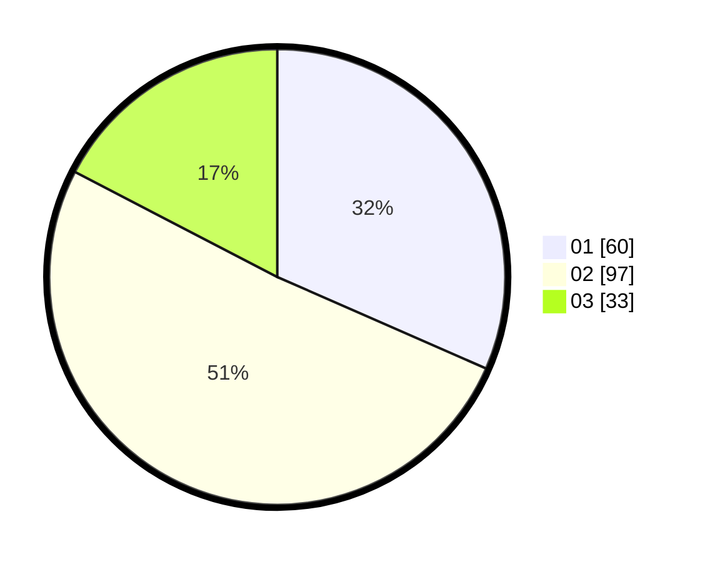

# Hasil

Hasil perolehan suara paslon dapat dilihat pada file paslon-01.txt, paslon-02.txt, dan paslon-03.txt.

Jika tidak ada, artinya data tersebut belum ada pada SIREKAP.

## Perolehan Suara

 * Paslon 01: **60**.
 * Paslon 02: **97**.
 * Paslon 03: **33**.

## Foto C Plano

https://sirekap-obj-formc.kpu.go.id/6667/pemilu/ppwp/31/71/03/10/01/3171031001053-20240216-140707--49bc7d2b-456e-46ae-98f5-d8f242f374a0.jpg

https://sirekap-obj-formc.kpu.go.id/6667/pemilu/ppwp/31/71/03/10/01/3171031001053-20240216-140708--c351076a-156d-47fc-b9d0-41175ca4f84f.jpg

https://sirekap-obj-formc.kpu.go.id/6667/pemilu/ppwp/31/71/03/10/01/3171031001053-20240216-140707--d209c05f-82e4-4d9c-bcdb-0fdbf4ffcf0c.jpg

## DATA PEMILIH TETAP

Jumlah pemilih dalam DPT: **278**.
 * L: **140**.
 * P: **138**.

## DATA PENGGUNA HAK PILIH

Jumlah pengguna hak pilih dalam DPT: **278**.
 * L: **140**.
 * P: **138**.

Jumlah pengguna hak pilih dalam DPTb: **0**.
 * L: **0**.
 * P: **0**.

Jumlah pengguna hak pilih dalam DPK: **0**.
 * L: **0**.
 * P: **0**.

Jumlah pengguna hak pilih: **278**.
 * L: **140**.
 * P: **138**.

## JUMLAH SUARA SAH DAN TIDAK SAH

JUMLAH SELURUH SUARA SAH: **190**.

JUMLAH SUARA TIDAK SAH: **6**.

JUMLAH SELURUH SUARA SAH DAN SUARA TIDAK SAH: **196**.
