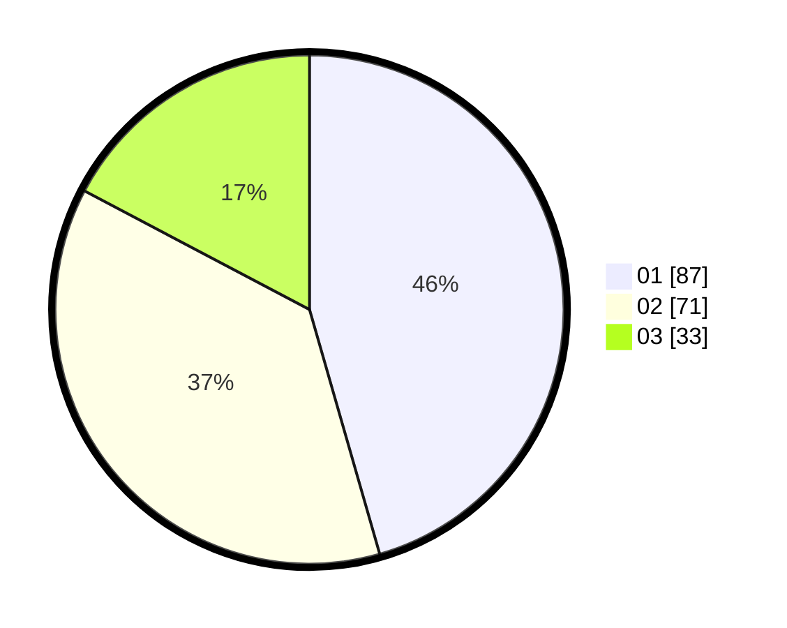

# Hasil

Hasil perolehan suara paslon dapat dilihat pada file paslon-01.txt, paslon-02.txt, dan paslon-03.txt.

Jika tidak ada, artinya data tersebut belum ada pada SIREKAP.

## Perolehan Suara

 * Paslon 01: **87**.
 * Paslon 02: **71**.
 * Paslon 03: **33**.

## Foto C Plano

https://sirekap-obj-formc.kpu.go.id/e21e/pemilu/ppwp/31/71/03/10/01/3171031001057-20240216-171745--2f76e014-7e19-4523-8e50-40b087e60244.jpg

https://sirekap-obj-formc.kpu.go.id/e21e/pemilu/ppwp/31/71/03/10/01/3171031001057-20240216-171747--8fce3856-7943-42e5-836e-d5b76b892605.jpg

https://sirekap-obj-formc.kpu.go.id/e21e/pemilu/ppwp/31/71/03/10/01/3171031001057-20240216-171746--9a5f79cf-9286-4e86-85b4-44f4d4c7a18f.jpg

## DATA PEMILIH TETAP

Jumlah pemilih dalam DPT: **262**.
 * L: **125**.
 * P: **137**.

## DATA PENGGUNA HAK PILIH

Jumlah pengguna hak pilih dalam DPT: **193**.
 * L: **93**.
 * P: **100**.

Jumlah pengguna hak pilih dalam DPTb: **0**.
 * L: **0**.
 * P: **0**.

Jumlah pengguna hak pilih dalam DPK: **1**.
 * L: **1**.
 * P: **0**.

Jumlah pengguna hak pilih: **194**.
 * L: **94**.
 * P: **100**.

## JUMLAH SUARA SAH DAN TIDAK SAH

JUMLAH SELURUH SUARA SAH: **191**.

JUMLAH SUARA TIDAK SAH: **3**.

JUMLAH SELURUH SUARA SAH DAN SUARA TIDAK SAH: **194**.
