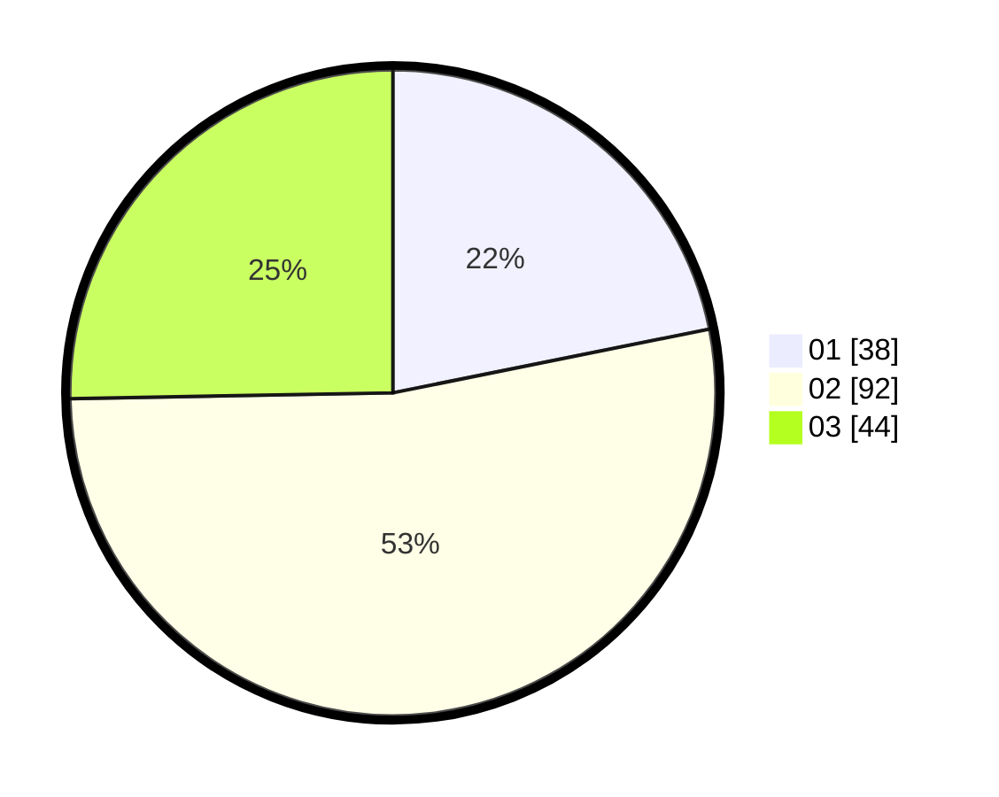

# Hasil

Hasil perolehan suara paslon dapat dilihat pada file paslon-01.txt, paslon-02.txt, dan paslon-03.txt.

Jika tidak ada, artinya data tersebut belum ada pada SIREKAP.

## Perolehan Suara

 * Paslon 01: **38**.
 * Paslon 02: **92**.
 * Paslon 03: **44**.

## Foto C Plano

https://sirekap-obj-formc.kpu.go.id/c85f/pemilu/ppwp/31/71/03/10/01/3171031001060-20240215-000837--97de98c6-3e2b-4d33-9964-c37adf4620a2.jpg

https://sirekap-obj-formc.kpu.go.id/c85f/pemilu/ppwp/31/71/03/10/01/3171031001060-20240214-234053--857bf140-28c1-4aae-8161-8d6f5ef2322d.jpg

https://sirekap-obj-formc.kpu.go.id/c85f/pemilu/ppwp/31/71/03/10/01/3171031001060-20240215-001554--73a362af-2cfa-47f5-8c2b-57636b946dc0.jpg

## DATA PEMILIH TETAP

Jumlah pemilih dalam DPT: **260**.
 * L: **127**.
 * P: **133**.

## DATA PENGGUNA HAK PILIH

Jumlah pengguna hak pilih dalam DPT: **173**.
 * L: **86**.
 * P: **87**.

Jumlah pengguna hak pilih dalam DPTb: **4**.
 * L: **3**.
 * P: **1**.

Jumlah pengguna hak pilih dalam DPK: **3**.
 * L: **2**.
 * P: **1**.

Jumlah pengguna hak pilih: **180**.
 * L: **91**.
 * P: **89**.

## JUMLAH SUARA SAH DAN TIDAK SAH

JUMLAH SELURUH SUARA SAH: **174**.

JUMLAH SUARA TIDAK SAH: **6**.

JUMLAH SELURUH SUARA SAH DAN SUARA TIDAK SAH: **180**.
