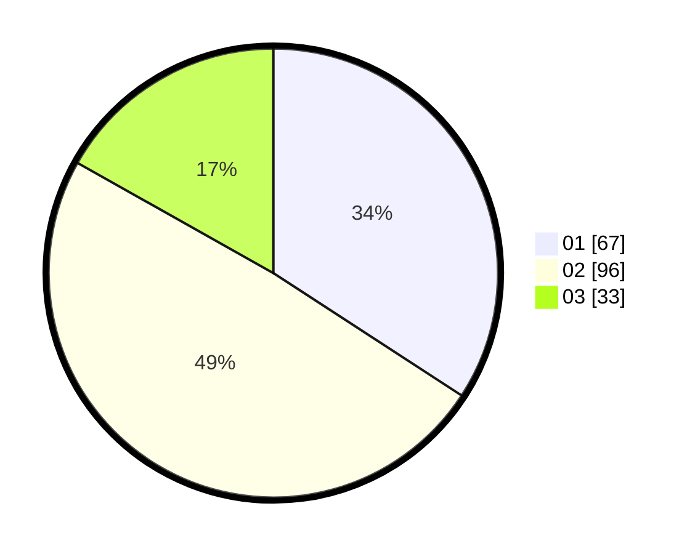

# Hasil

Hasil perolehan suara paslon dapat dilihat pada file paslon-01.txt, paslon-02.txt, dan paslon-03.txt.

Jika tidak ada, artinya data tersebut belum ada pada SIREKAP.

## Perolehan Suara

 * Paslon 01: **67**.
 * Paslon 02: **96**.
 * Paslon 03: **33**.

## Foto C Plano

https://sirekap-obj-formc.kpu.go.id/65a5/pemilu/ppwp/31/71/03/10/01/3171031001061-20240216-161332--b5b16075-23d2-4e6c-9ca2-b5af3e238cb2.jpg

https://sirekap-obj-formc.kpu.go.id/65a5/pemilu/ppwp/31/71/03/10/01/3171031001061-20240216-161350--600219f4-ced8-4e4b-b84c-1a28c1f78c58.jpg
