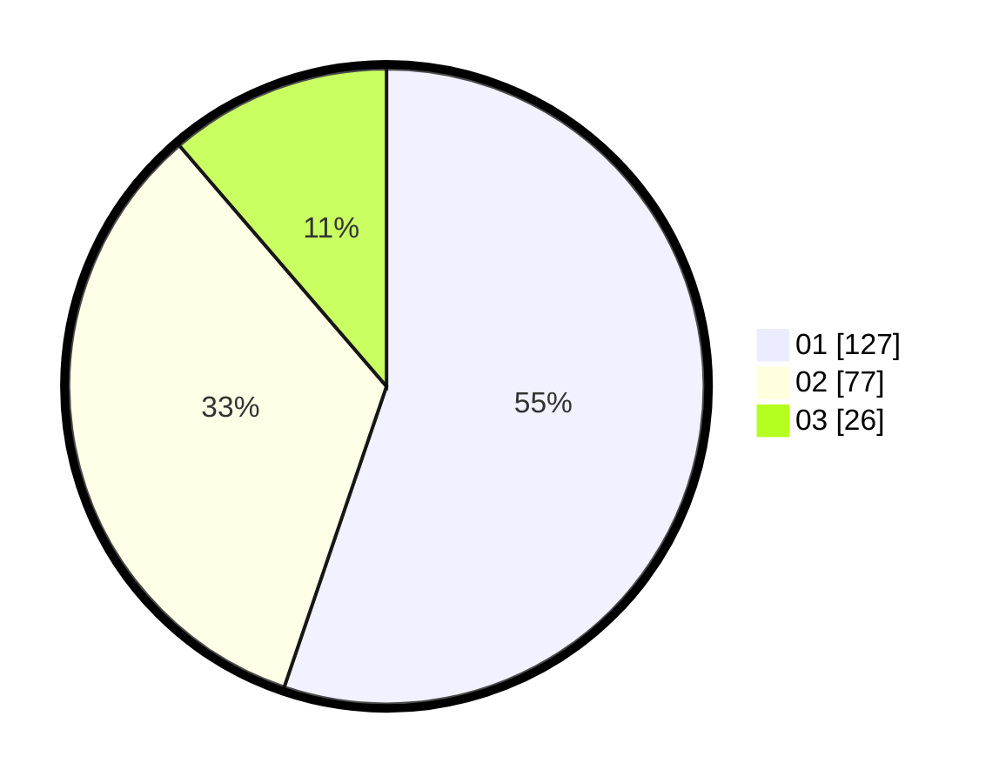

# Hasil

Hasil perolehan suara paslon dapat dilihat pada file paslon-01.txt, paslon-02.txt, dan paslon-03.txt.

Jika tidak ada, artinya data tersebut belum ada pada SIREKAP.

## Perolehan Suara

 * Paslon 01: **127**.
 * Paslon 02: **77**.
 * Paslon 03: **26**.

## Foto C Plano

https://sirekap-obj-formc.kpu.go.id/07b6/pemilu/ppwp/31/71/03/10/01/3171031001066-20240217-102059--9df00032-af6b-4430-a6fc-cbc61775caf0.jpg

https://sirekap-obj-formc.kpu.go.id/07b6/pemilu/ppwp/31/71/03/10/01/3171031001066-20240217-102100--d524b19a-c390-40bd-85b8-93ef8a1b8b57.jpg

https://sirekap-obj-formc.kpu.go.id/07b6/pemilu/ppwp/31/71/03/10/01/3171031001066-20240217-102059--cd02a6e6-b04b-40ee-8391-25003c32f1a5.jpg

## DATA PEMILIH TETAP

Jumlah pemilih dalam DPT: **292**.
 * L: **155**.
 * P: **137**.

## DATA PENGGUNA HAK PILIH

Jumlah pengguna hak pilih dalam DPT: **231**.
 * L: **116**.
 * P: **115**.

Jumlah pengguna hak pilih dalam DPTb: **0**.
 * L: **0**.
 * P: **0**.

Jumlah pengguna hak pilih dalam DPK: **1**.
 * L: **0**.
 * P: **1**.

Jumlah pengguna hak pilih: **232**.
 * L: **116**.
 * P: **116**.

## JUMLAH SUARA SAH DAN TIDAK SAH

JUMLAH SELURUH SUARA SAH: **230**.

JUMLAH SUARA TIDAK SAH: **2**.

JUMLAH SELURUH SUARA SAH DAN SUARA TIDAK SAH: **232**.
