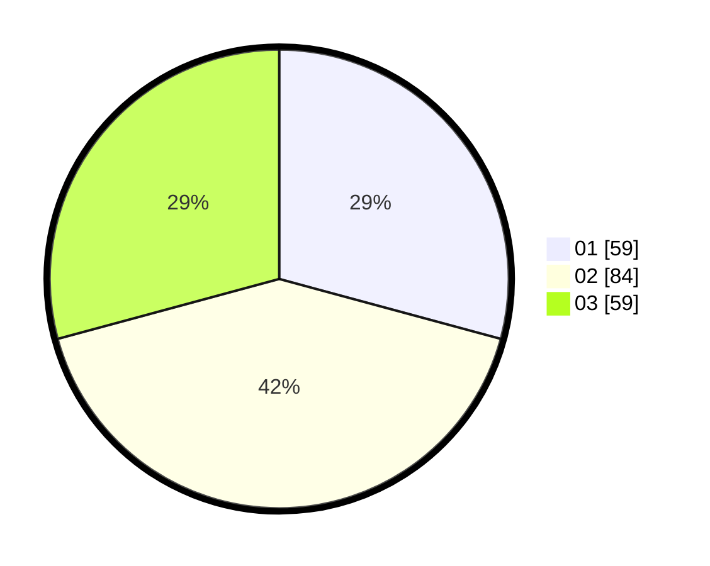

# Hasil

Hasil perolehan suara paslon dapat dilihat pada file paslon-01.txt, paslon-02.txt, dan paslon-03.txt.

Jika tidak ada, artinya data tersebut belum ada pada SIREKAP.

## Perolehan Suara

 * Paslon 01: **59**.
 * Paslon 02: **84**.
 * Paslon 03: **59**.

## Foto C Plano

https://sirekap-obj-formc.kpu.go.id/dc00/pemilu/ppwp/31/71/03/10/01/3171031001068-20240214-184531--341e1f3d-7f49-461a-b07e-f6c556d6e54d.jpg

https://sirekap-obj-formc.kpu.go.id/dc00/pemilu/ppwp/31/71/03/10/01/3171031001068-20240214-184541--f063ff36-7caa-415a-80d7-5e28203bec78.jpg

https://sirekap-obj-formc.kpu.go.id/dc00/pemilu/ppwp/31/71/03/10/01/3171031001068-20240214-184549--6feb434d-8652-4b34-9388-164204470747.jpg

## DATA PEMILIH TETAP

Jumlah pemilih dalam DPT: **261**.
 * L: **125**.
 * P: **136**.

## DATA PENGGUNA HAK PILIH

Jumlah pengguna hak pilih dalam DPT: **204**.
 * L: **96**.
 * P: **108**.

Jumlah pengguna hak pilih dalam DPTb: **4**.
 * L: **3**.
 * P: **1**.

Jumlah pengguna hak pilih dalam DPK: **0**.
 * L: **0**.
 * P: **0**.

Jumlah pengguna hak pilih: **208**.
 * L: **99**.
 * P: **109**.

## JUMLAH SUARA SAH DAN TIDAK SAH

JUMLAH SELURUH SUARA SAH: **202**.

JUMLAH SUARA TIDAK SAH: **6**.

JUMLAH SELURUH SUARA SAH DAN SUARA TIDAK SAH: **208**.
