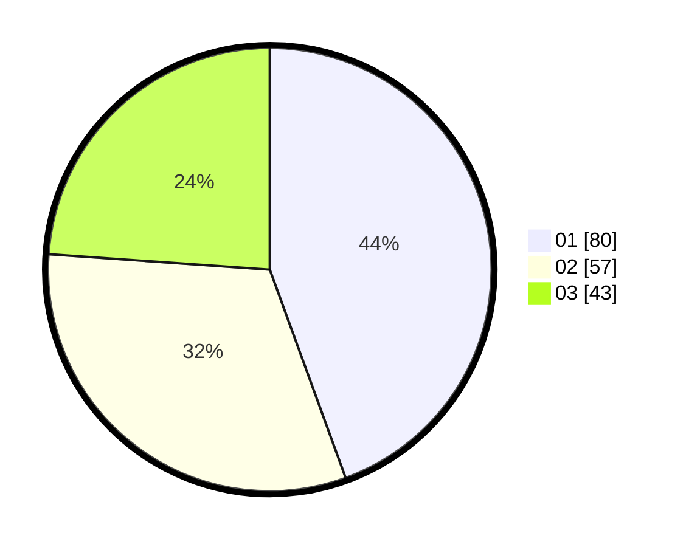

# Hasil

Hasil perolehan suara paslon dapat dilihat pada file paslon-01.txt, paslon-02.txt, dan paslon-03.txt.

Jika tidak ada, artinya data tersebut belum ada pada SIREKAP.

## Perolehan Suara

 * Paslon 01: **80**.
 * Paslon 02: **57**.
 * Paslon 03: **43**.

## Foto C Plano

https://sirekap-obj-formc.kpu.go.id/9899/pemilu/ppwp/31/71/03/10/02/3171031002002-20240214-190157--508fa4a6-7159-485a-890e-4899511ca2a1.jpg

https://sirekap-obj-formc.kpu.go.id/9899/pemilu/ppwp/31/71/03/10/02/3171031002002-20240214-232618--796bcde1-11f9-4ece-ab8f-d47a59f66792.jpg

https://sirekap-obj-formc.kpu.go.id/9899/pemilu/ppwp/31/71/03/10/02/3171031002002-20240214-190524--3c97ad13-3e1c-4833-a410-faa5df250be9.jpg

## DATA PEMILIH TETAP

Jumlah pemilih dalam DPT: **196**.
 * L: **93**.
 * P: **103**.

## DATA PENGGUNA HAK PILIH

Jumlah pengguna hak pilih dalam DPT: **264**.
 * L: **135**.
 * P: **129**.

Jumlah pengguna hak pilih dalam DPTb: **2**.
 * L: **1**.
 * P: **1**.

Jumlah pengguna hak pilih dalam DPK: **0**.
 * L: **0**.
 * P: **0**.

Jumlah pengguna hak pilih: **266**.
 * L: **136**.
 * P: **130**.

## JUMLAH SUARA SAH DAN TIDAK SAH

JUMLAH SELURUH SUARA SAH: **180**.

JUMLAH SUARA TIDAK SAH: **18**.

JUMLAH SELURUH SUARA SAH DAN SUARA TIDAK SAH: **198**.
