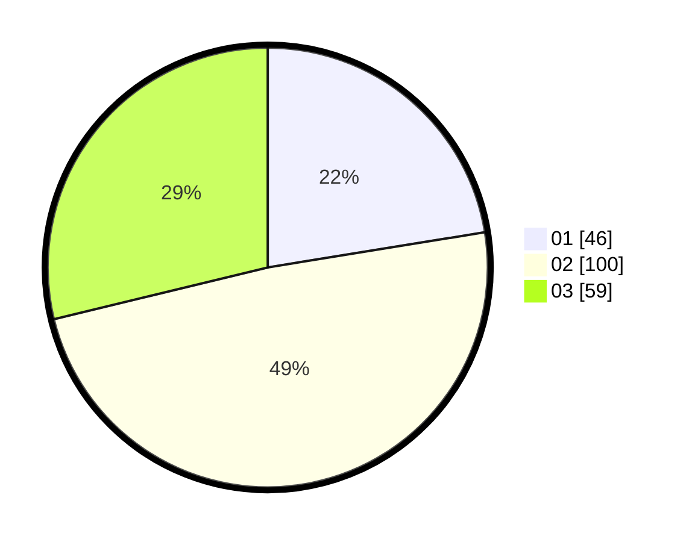

# Hasil

Hasil perolehan suara paslon dapat dilihat pada file paslon-01.txt, paslon-02.txt, dan paslon-03.txt.

Jika tidak ada, artinya data tersebut belum ada pada SIREKAP.

## Perolehan Suara

 * Paslon 01: **46**.
 * Paslon 02: **100**.
 * Paslon 03: **59**.

## Foto C Plano

https://sirekap-obj-formc.kpu.go.id/8df0/pemilu/ppwp/31/71/03/10/02/3171031002003-20240216-235304--1d1393c5-675b-4678-a4c9-ad95a195186a.jpg

https://sirekap-obj-formc.kpu.go.id/8df0/pemilu/ppwp/31/71/03/10/02/3171031002003-20240216-182943--a65a2b11-4181-4218-9253-98b8ff1948ad.jpg

https://sirekap-obj-formc.kpu.go.id/8df0/pemilu/ppwp/31/71/03/10/02/3171031002003-20240216-235305--ac9288c1-bd67-4376-a6f1-11a268f2f766.jpg

## DATA PEMILIH TETAP

Jumlah pemilih dalam DPT: **275**.
 * L: **140**.
 * P: **135**.

## DATA PENGGUNA HAK PILIH

Jumlah pengguna hak pilih dalam DPT: **208**.
 * L: **101**.
 * P: **107**.

Jumlah pengguna hak pilih dalam DPTb: **0**.
 * L: **0**.
 * P: **0**.

Jumlah pengguna hak pilih dalam DPK: **0**.
 * L: **0**.
 * P: **0**.

Jumlah pengguna hak pilih: **208**.
 * L: **101**.
 * P: **107**.

## JUMLAH SUARA SAH DAN TIDAK SAH

JUMLAH SELURUH SUARA SAH: **205**.

JUMLAH SUARA TIDAK SAH: **3**.

JUMLAH SELURUH SUARA SAH DAN SUARA TIDAK SAH: **208**.
