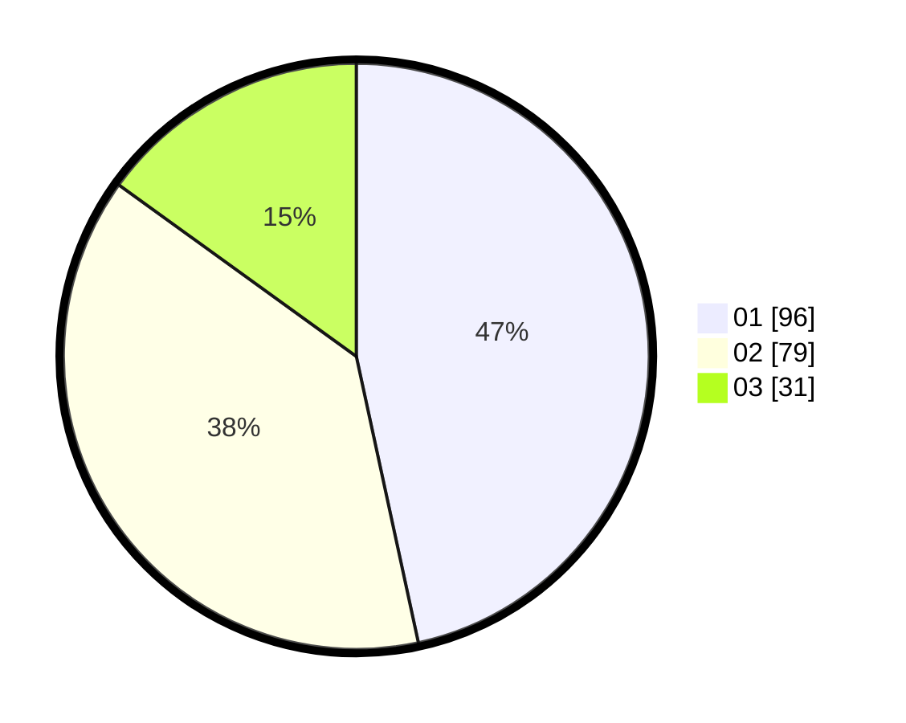

# Hasil

Hasil perolehan suara paslon dapat dilihat pada file paslon-01.txt, paslon-02.txt, dan paslon-03.txt.

Jika tidak ada, artinya data tersebut belum ada pada SIREKAP.

## Perolehan Suara

 * Paslon 01: **96**.
 * Paslon 02: **79**.
 * Paslon 03: **31**.

## Foto C Plano

https://sirekap-obj-formc.kpu.go.id/25d2/pemilu/ppwp/31/71/03/10/02/3171031002005-20240216-111813--97793c65-74d5-462a-8965-a158494e64dc.jpg

https://sirekap-obj-formc.kpu.go.id/25d2/pemilu/ppwp/31/71/03/10/02/3171031002005-20240216-112055--edc072a0-61af-4d2f-a93c-81dc01557e68.jpg

https://sirekap-obj-formc.kpu.go.id/25d2/pemilu/ppwp/31/71/03/10/02/3171031002005-20240216-112151--af9dc9e0-c6f3-4f55-a687-28ec27678e93.jpg

## DATA PEMILIH TETAP

Jumlah pemilih dalam DPT: **274**.
 * L: **142**.
 * P: **132**.

## DATA PENGGUNA HAK PILIH

Jumlah pengguna hak pilih dalam DPT: **209**.
 * L: **100**.
 * P: **109**.

Jumlah pengguna hak pilih dalam DPTb: **2**.
 * L: **2**.
 * P: **0**.

Jumlah pengguna hak pilih dalam DPK: **0**.
 * L: **0**.
 * P: **0**.

Jumlah pengguna hak pilih: **211**.
 * L: **102**.
 * P: **109**.

## JUMLAH SUARA SAH DAN TIDAK SAH

JUMLAH SELURUH SUARA SAH: **206**.

JUMLAH SUARA TIDAK SAH: **5**.

JUMLAH SELURUH SUARA SAH DAN SUARA TIDAK SAH: **211**.
