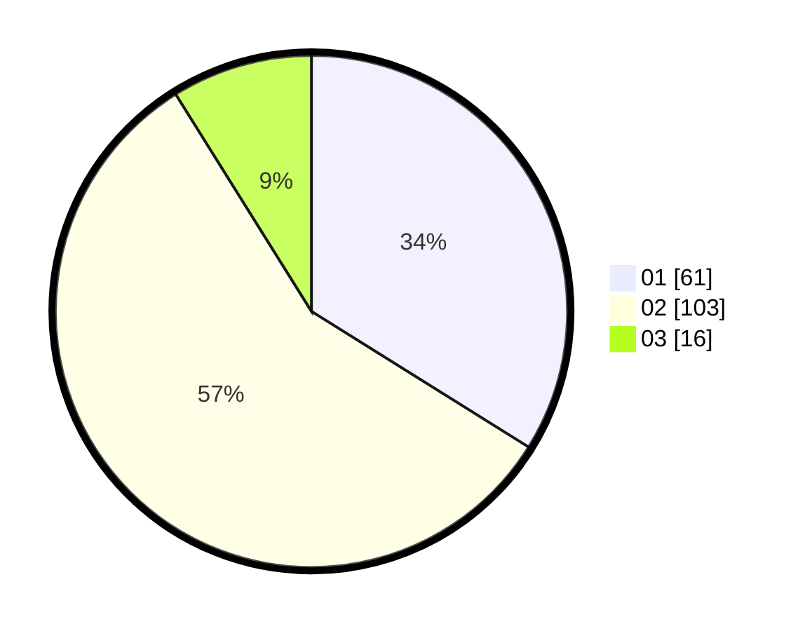

# Hasil

Hasil perolehan suara paslon dapat dilihat pada file paslon-01.txt, paslon-02.txt, dan paslon-03.txt.

Jika tidak ada, artinya data tersebut belum ada pada SIREKAP.

## Perolehan Suara

 * Paslon 01: **61**.
 * Paslon 02: **103**.
 * Paslon 03: **16**.

## Foto C Plano

https://sirekap-obj-formc.kpu.go.id/0e4c/pemilu/ppwp/31/71/03/10/02/3171031002006-20240214-221733--b51c6ef5-312a-4b16-a47a-b17d961022e7.jpg

https://sirekap-obj-formc.kpu.go.id/0e4c/pemilu/ppwp/31/71/03/10/02/3171031002006-20240214-232134--0b4b8de7-2615-4f86-8b2a-dd14a863c6a5.jpg

https://sirekap-obj-formc.kpu.go.id/0e4c/pemilu/ppwp/31/71/03/10/02/3171031002006-20240214-231859--fc3ba521-ef28-4d10-905b-e90db51468b3.jpg
