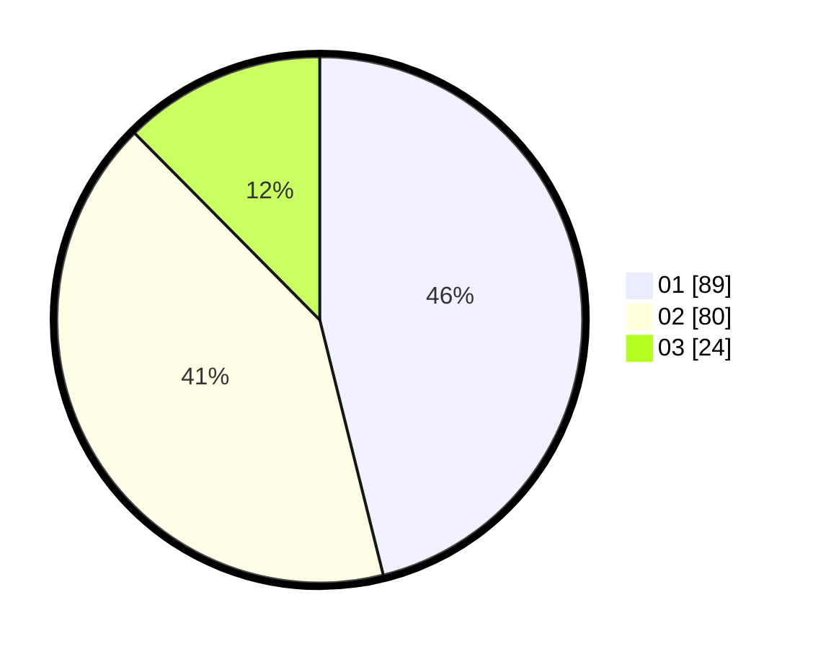

# Hasil

Hasil perolehan suara paslon dapat dilihat pada file paslon-01.txt, paslon-02.txt, dan paslon-03.txt.

Jika tidak ada, artinya data tersebut belum ada pada SIREKAP.

## Perolehan Suara

 * Paslon 01: **89**.
 * Paslon 02: **80**.
 * Paslon 03: **24**.

## Foto C Plano

https://sirekap-obj-formc.kpu.go.id/d8e6/pemilu/ppwp/31/71/03/10/02/3171031002010-20240214-232145--d2845796-2058-4dbc-b58d-d96854129863.jpg

https://sirekap-obj-formc.kpu.go.id/d8e6/pemilu/ppwp/31/71/03/10/02/3171031002010-20240214-232024--c321fb3e-3386-4d32-97ae-02943ebb3e3e.jpg

https://sirekap-obj-formc.kpu.go.id/d8e6/pemilu/ppwp/31/71/03/10/02/3171031002010-20240214-232103--3388a3c0-dccc-4c02-be70-6d5135d92a47.jpg
