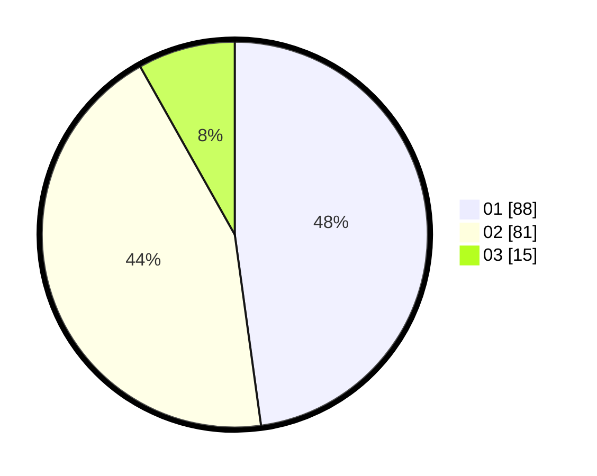

# Hasil

Hasil perolehan suara paslon dapat dilihat pada file paslon-01.txt, paslon-02.txt, dan paslon-03.txt.

Jika tidak ada, artinya data tersebut belum ada pada SIREKAP.

## Perolehan Suara

 * Paslon 01: **88**.
 * Paslon 02: **81**.
 * Paslon 03: **15**.

## Foto C Plano

https://sirekap-obj-formc.kpu.go.id/529c/pemilu/ppwp/31/71/03/10/02/3171031002013-20240216-215114--c0e37a9b-015a-4b99-a80c-80945aee6408.jpg

https://sirekap-obj-formc.kpu.go.id/529c/pemilu/ppwp/31/71/03/10/02/3171031002013-20240216-215705--e24dfb6d-a9cf-4996-b86c-2874dd79db21.jpg

https://sirekap-obj-formc.kpu.go.id/529c/pemilu/ppwp/31/71/03/10/02/3171031002013-20240216-215439--d99721ab-00e2-4cb8-af40-5b2fc4e167c5.jpg

## DATA PEMILIH TETAP

Jumlah pemilih dalam DPT: **261**.
 * L: **136**.
 * P: **125**.

## DATA PENGGUNA HAK PILIH

Jumlah pengguna hak pilih dalam DPT: **187**.
 * L: **100**.
 * P: **87**.

Jumlah pengguna hak pilih dalam DPTb: **0**.
 * L: **0**.
 * P: **0**.

Jumlah pengguna hak pilih dalam DPK: **0**.
 * L: **0**.
 * P: **0**.

Jumlah pengguna hak pilih: **187**.
 * L: **100**.
 * P: **87**.

## JUMLAH SUARA SAH DAN TIDAK SAH

JUMLAH SELURUH SUARA SAH: **184**.

JUMLAH SUARA TIDAK SAH: **3**.

JUMLAH SELURUH SUARA SAH DAN SUARA TIDAK SAH: **187**.
