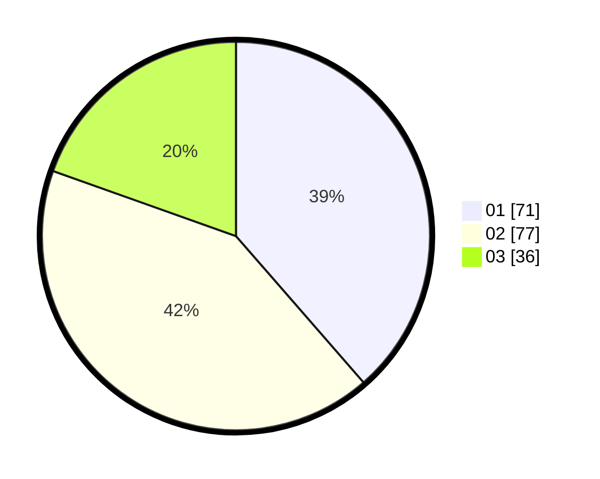

# Hasil

Hasil perolehan suara paslon dapat dilihat pada file paslon-01.txt, paslon-02.txt, dan paslon-03.txt.

Jika tidak ada, artinya data tersebut belum ada pada SIREKAP.

## Perolehan Suara

 * Paslon 01: **71**.
 * Paslon 02: **77**.
 * Paslon 03: **36**.

## Foto C Plano

https://sirekap-obj-formc.kpu.go.id/1c83/pemilu/ppwp/31/71/03/10/02/3171031002015-20240215-190140--e9d7d797-4188-4547-b4fc-1a5399cbb062.jpg

https://sirekap-obj-formc.kpu.go.id/1c83/pemilu/ppwp/31/71/03/10/02/3171031002015-20240215-190202--e58f1e97-222a-4486-9dff-94f97e60288b.jpg

https://sirekap-obj-formc.kpu.go.id/1c83/pemilu/ppwp/31/71/03/10/02/3171031002015-20240215-190151--72b66e44-a50f-4595-ae06-e7f76423f2e6.jpg

## DATA PEMILIH TETAP

Jumlah pemilih dalam DPT: **274**.
 * L: **138**.
 * P: **136**.

## DATA PENGGUNA HAK PILIH

Jumlah pengguna hak pilih dalam DPT: **186**.
 * L: **87**.
 * P: **99**.

Jumlah pengguna hak pilih dalam DPTb: **1**.
 * L: **1**.
 * P: **0**.

Jumlah pengguna hak pilih dalam DPK: **0**.
 * L: **0**.
 * P: **0**.

Jumlah pengguna hak pilih: **187**.
 * L: **88**.
 * P: **99**.

## JUMLAH SUARA SAH DAN TIDAK SAH

JUMLAH SELURUH SUARA SAH: **184**.

JUMLAH SUARA TIDAK SAH: **3**.

JUMLAH SELURUH SUARA SAH DAN SUARA TIDAK SAH: **187**.
