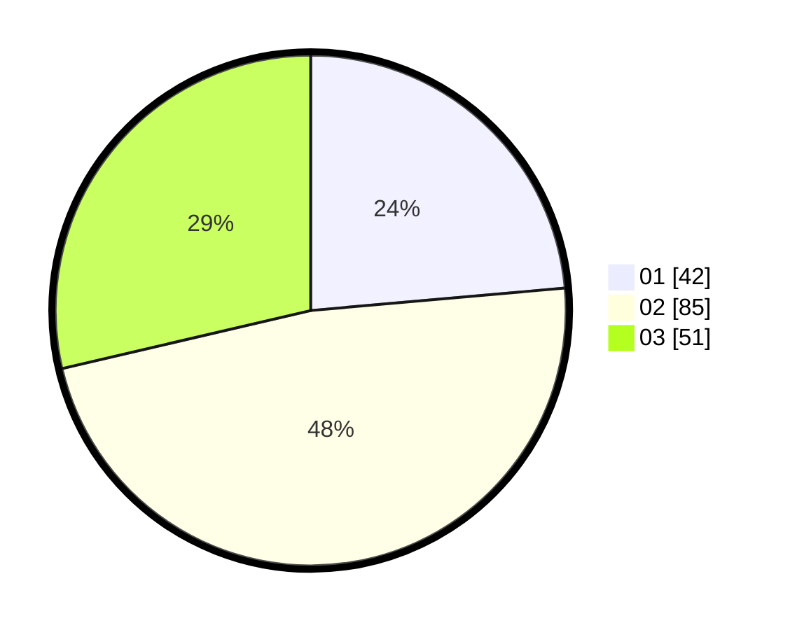

# Hasil

Hasil perolehan suara paslon dapat dilihat pada file paslon-01.txt, paslon-02.txt, dan paslon-03.txt.

Jika tidak ada, artinya data tersebut belum ada pada SIREKAP.

## Perolehan Suara

 * Paslon 01: **42**.
 * Paslon 02: **85**.
 * Paslon 03: **51**.

## Foto C Plano

https://sirekap-obj-formc.kpu.go.id/6080/pemilu/ppwp/31/71/03/10/02/3171031002018-20240216-173818--07e208ad-a65b-4e27-971c-3988b983b59b.jpg

https://sirekap-obj-formc.kpu.go.id/6080/pemilu/ppwp/31/71/03/10/02/3171031002018-20240216-174648--e2203028-0d9d-4233-9ff7-f34db5d0221c.jpg

https://sirekap-obj-formc.kpu.go.id/6080/pemilu/ppwp/31/71/03/10/02/3171031002018-20240216-174647--6dbfaf57-2270-4a87-b091-c9fb1da01c7e.jpg

## DATA PEMILIH TETAP

Jumlah pemilih dalam DPT: **243**.
 * L: **126**.
 * P: **117**.

## DATA PENGGUNA HAK PILIH

Jumlah pengguna hak pilih dalam DPT: **178**.
 * L: **92**.
 * P: **86**.

Jumlah pengguna hak pilih dalam DPTb: **1**.
 * L: **0**.
 * P: **1**.

Jumlah pengguna hak pilih dalam DPK: **0**.
 * L: **0**.
 * P: **0**.

Jumlah pengguna hak pilih: **179**.
 * L: **92**.
 * P: **87**.

## JUMLAH SUARA SAH DAN TIDAK SAH

JUMLAH SELURUH SUARA SAH: **178**.

JUMLAH SUARA TIDAK SAH: **1**.

JUMLAH SELURUH SUARA SAH DAN SUARA TIDAK SAH: **179**.
