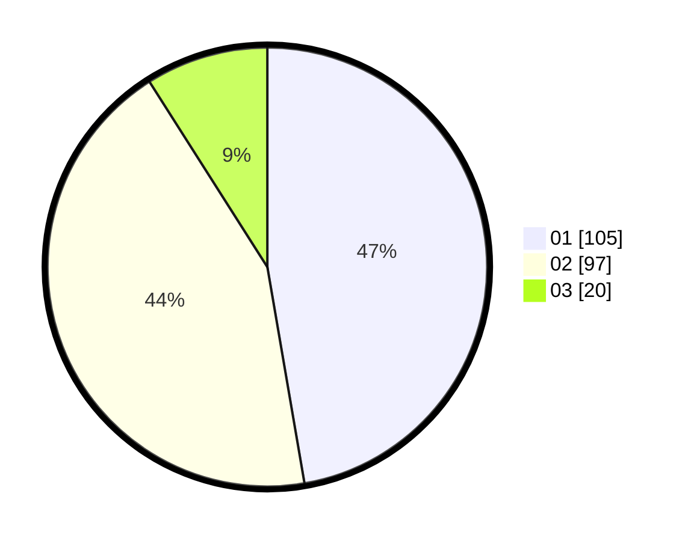

# Hasil

Hasil perolehan suara paslon dapat dilihat pada file paslon-01.txt, paslon-02.txt, dan paslon-03.txt.

Jika tidak ada, artinya data tersebut belum ada pada SIREKAP.

## Perolehan Suara

 * Paslon 01: **105**.
 * Paslon 02: **97**.
 * Paslon 03: **20**.

## Foto C Plano

https://sirekap-obj-formc.kpu.go.id/a61e/pemilu/ppwp/31/71/03/10/02/3171031002020-20240216-185302--28767858-1a25-4886-bb4f-1cd8023c63cd.jpg

https://sirekap-obj-formc.kpu.go.id/a61e/pemilu/ppwp/31/71/03/10/02/3171031002020-20240216-082151--cecf42ff-4951-4132-a632-318d028ed0f8.jpg

https://sirekap-obj-formc.kpu.go.id/a61e/pemilu/ppwp/31/71/03/10/02/3171031002020-20240216-185302--616931cb-9f1d-440b-807b-c8a55ab8dd84.jpg

## DATA PEMILIH TETAP

Jumlah pemilih dalam DPT: **0**.
 * L: **0**.
 * P: **0**.

## DATA PENGGUNA HAK PILIH

Jumlah pengguna hak pilih dalam DPT: **0**.
 * L: **0**.
 * P: **0**.

Jumlah pengguna hak pilih dalam DPTb: **0**.
 * L: **0**.
 * P: **0**.

Jumlah pengguna hak pilih dalam DPK: **0**.
 * L: **0**.
 * P: **0**.

Jumlah pengguna hak pilih: **0**.
 * L: **0**.
 * P: **0**.

## JUMLAH SUARA SAH DAN TIDAK SAH

JUMLAH SELURUH SUARA SAH: **0**.

JUMLAH SUARA TIDAK SAH: **0**.

JUMLAH SELURUH SUARA SAH DAN SUARA TIDAK SAH: **0**.
