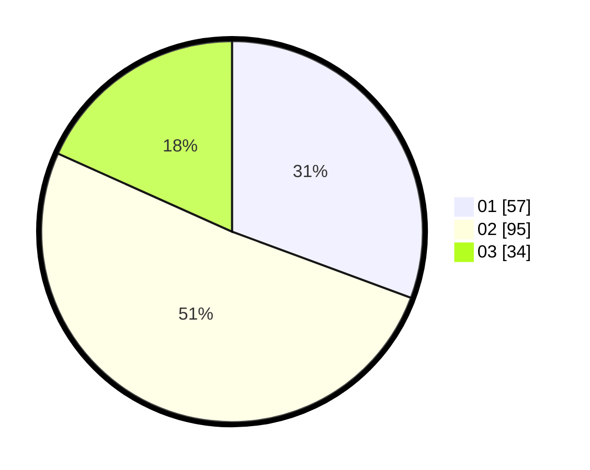

# Hasil

Hasil perolehan suara paslon dapat dilihat pada file paslon-01.txt, paslon-02.txt, dan paslon-03.txt.

Jika tidak ada, artinya data tersebut belum ada pada SIREKAP.

## Perolehan Suara

 * Paslon 01: **57**.
 * Paslon 02: **95**.
 * Paslon 03: **34**.

## Foto C Plano

https://sirekap-obj-formc.kpu.go.id/c57b/pemilu/ppwp/31/71/03/10/02/3171031002022-20240216-161842--2a54223d-9539-4257-800b-25d107c8e973.jpg

https://sirekap-obj-formc.kpu.go.id/c57b/pemilu/ppwp/31/71/03/10/02/3171031002022-20240216-165630--ff9ff714-657c-4527-b0f1-e943621f26a2.jpg

https://sirekap-obj-formc.kpu.go.id/c57b/pemilu/ppwp/31/71/03/10/02/3171031002022-20240216-162108--5ce93a89-c58b-4a5e-9ba5-88f2af0ae25e.jpg

## DATA PEMILIH TETAP

Jumlah pemilih dalam DPT: **289**.
 * L: **131**.
 * P: **158**.

## DATA PENGGUNA HAK PILIH

Jumlah pengguna hak pilih dalam DPT: **188**.
 * L: **88**.
 * P: **100**.

Jumlah pengguna hak pilih dalam DPTb: **0**.
 * L: **0**.
 * P: **0**.

Jumlah pengguna hak pilih dalam DPK: **0**.
 * L: **0**.
 * P: **0**.

Jumlah pengguna hak pilih: **188**.
 * L: **88**.
 * P: **100**.

## JUMLAH SUARA SAH DAN TIDAK SAH

JUMLAH SELURUH SUARA SAH: **186**.

JUMLAH SUARA TIDAK SAH: **2**.

JUMLAH SELURUH SUARA SAH DAN SUARA TIDAK SAH: **188**.
