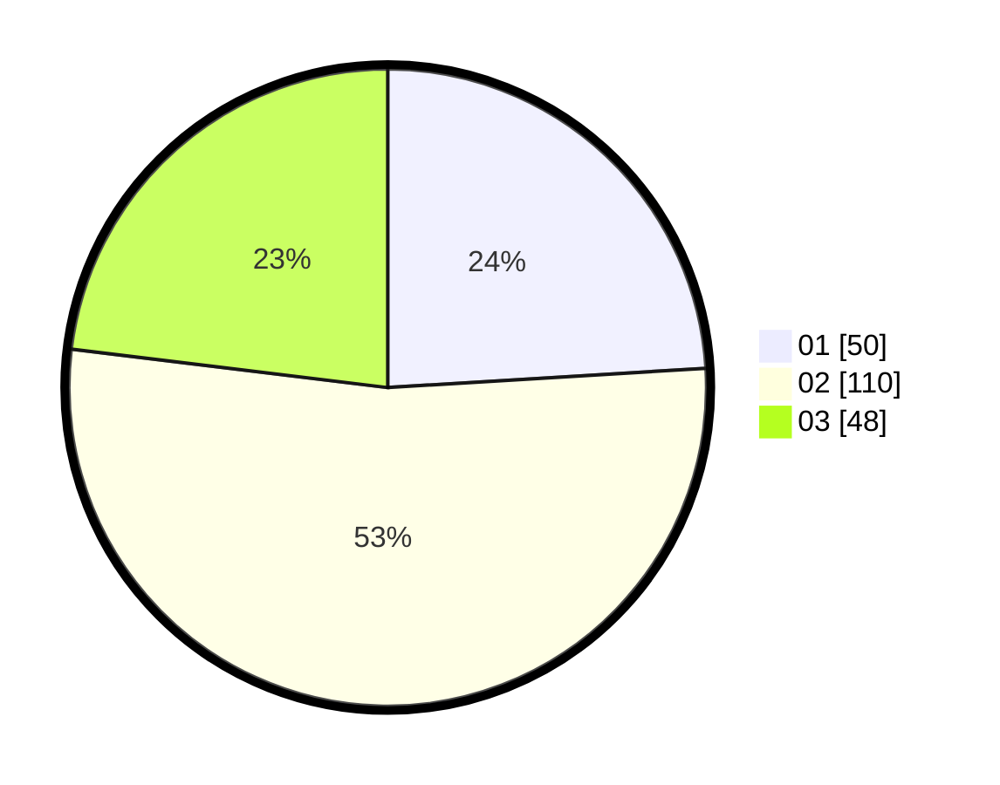

# Hasil

Hasil perolehan suara paslon dapat dilihat pada file paslon-01.txt, paslon-02.txt, dan paslon-03.txt.

Jika tidak ada, artinya data tersebut belum ada pada SIREKAP.

## Perolehan Suara

 * Paslon 01: **50**.
 * Paslon 02: **110**.
 * Paslon 03: **48**.

## Foto C Plano

https://sirekap-obj-formc.kpu.go.id/2563/pemilu/ppwp/31/71/03/10/02/3171031002025-20240215-194906--ba6b7861-40d0-4540-ab6f-3f7709ca0c0c.jpg

https://sirekap-obj-formc.kpu.go.id/2563/pemilu/ppwp/31/71/03/10/02/3171031002025-20240215-194917--a8be2534-c516-43e6-9b2f-82c88a08160e.jpg

https://sirekap-obj-formc.kpu.go.id/2563/pemilu/ppwp/31/71/03/10/02/3171031002025-20240215-194924--55a74d85-7fe4-43c5-8ed1-735370227712.jpg
