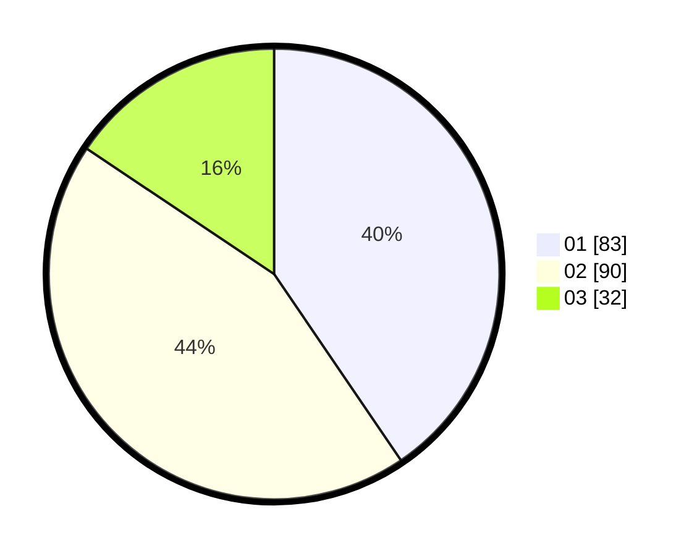

# Hasil

Hasil perolehan suara paslon dapat dilihat pada file paslon-01.txt, paslon-02.txt, dan paslon-03.txt.

Jika tidak ada, artinya data tersebut belum ada pada SIREKAP.

## Perolehan Suara

 * Paslon 01: **83**.
 * Paslon 02: **90**.
 * Paslon 03: **32**.

## Foto C Plano

https://sirekap-obj-formc.kpu.go.id/07df/pemilu/ppwp/31/71/03/10/02/3171031002026-20240214-155416--df1a97f3-d99c-4a62-8f3c-ec96f2e6ff9c.jpg

https://sirekap-obj-formc.kpu.go.id/07df/pemilu/ppwp/31/71/03/10/02/3171031002026-20240214-155426--4194e577-1383-4555-906a-6e865206756b.jpg

https://sirekap-obj-formc.kpu.go.id/07df/pemilu/ppwp/31/71/03/10/02/3171031002026-20240214-205946--58a5a119-328e-458c-add4-0b2d326c484f.jpg

## DATA PEMILIH TETAP

Jumlah pemilih dalam DPT: **286**.
 * L: **137**.
 * P: **149**.

## DATA PENGGUNA HAK PILIH

Jumlah pengguna hak pilih dalam DPT: **208**.
 * L: **90**.
 * P: **118**.

Jumlah pengguna hak pilih dalam DPTb: **0**.
 * L: **0**.
 * P: **0**.

Jumlah pengguna hak pilih dalam DPK: **1**.
 * L: **1**.
 * P: **0**.

Jumlah pengguna hak pilih: **209**.
 * L: **91**.
 * P: **118**.

## JUMLAH SUARA SAH DAN TIDAK SAH

JUMLAH SELURUH SUARA SAH: **205**.

JUMLAH SUARA TIDAK SAH: **4**.

JUMLAH SELURUH SUARA SAH DAN SUARA TIDAK SAH: **209**.
