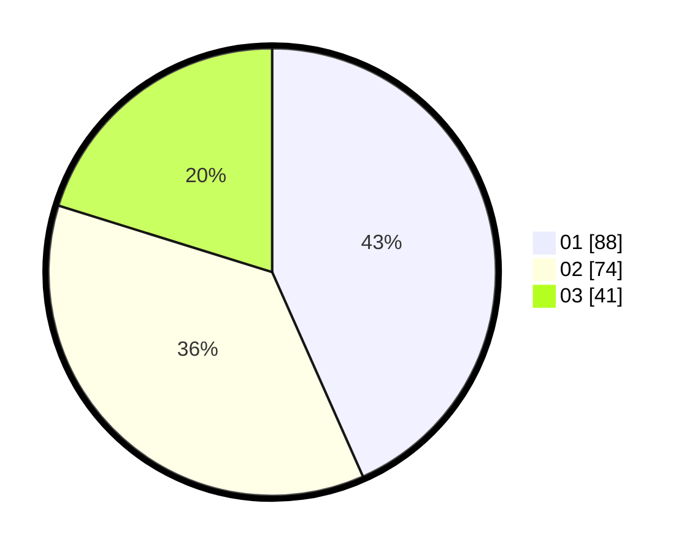

# Hasil

Hasil perolehan suara paslon dapat dilihat pada file paslon-01.txt, paslon-02.txt, dan paslon-03.txt.

Jika tidak ada, artinya data tersebut belum ada pada SIREKAP.

## Perolehan Suara

 * Paslon 01: **88**.
 * Paslon 02: **74**.
 * Paslon 03: **41**.

## Foto C Plano

https://sirekap-obj-formc.kpu.go.id/101f/pemilu/ppwp/31/71/03/10/02/3171031002027-20240214-185647--86a42f5d-af16-4402-b3cb-8af7629149d8.jpg

https://sirekap-obj-formc.kpu.go.id/101f/pemilu/ppwp/31/71/03/10/02/3171031002027-20240214-185717--10f1a67c-ed0f-4b92-a4d5-1201cd2a3745.jpg

https://sirekap-obj-formc.kpu.go.id/101f/pemilu/ppwp/31/71/03/10/02/3171031002027-20240214-185616--988c07ef-8e8d-4c71-9657-74c3974f8be3.jpg

## DATA PEMILIH TETAP

Jumlah pemilih dalam DPT: **282**.
 * L: **143**.
 * P: **139**.

## DATA PENGGUNA HAK PILIH

Jumlah pengguna hak pilih dalam DPT: **207**.
 * L: **102**.
 * P: **105**.

Jumlah pengguna hak pilih dalam DPTb: **1**.
 * L: **1**.
 * P: **0**.

Jumlah pengguna hak pilih dalam DPK: **0**.
 * L: **0**.
 * P: **0**.

Jumlah pengguna hak pilih: **208**.
 * L: **103**.
 * P: **105**.

## JUMLAH SUARA SAH DAN TIDAK SAH

JUMLAH SELURUH SUARA SAH: **203**.

JUMLAH SUARA TIDAK SAH: **5**.

JUMLAH SELURUH SUARA SAH DAN SUARA TIDAK SAH: **208**.
