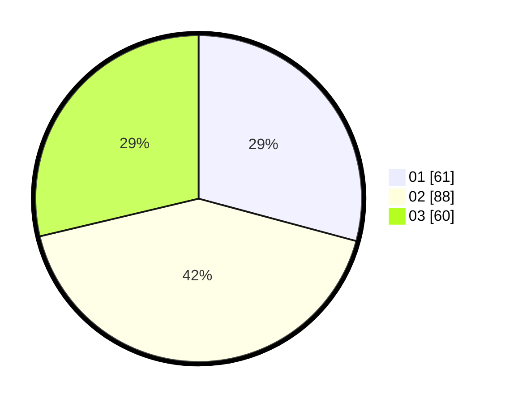

# Hasil

Hasil perolehan suara paslon dapat dilihat pada file paslon-01.txt, paslon-02.txt, dan paslon-03.txt.

Jika tidak ada, artinya data tersebut belum ada pada SIREKAP.

## Perolehan Suara

 * Paslon 01: **61**.
 * Paslon 02: **88**.
 * Paslon 03: **60**.

## Foto C Plano

https://sirekap-obj-formc.kpu.go.id/b7ab/pemilu/ppwp/31/71/03/10/02/3171031002029-20240215-014516--4094d1d1-2d4a-450b-8a17-7349c5ee3198.jpg

https://sirekap-obj-formc.kpu.go.id/b7ab/pemilu/ppwp/31/71/03/10/02/3171031002029-20240216-171635--9659718c-776a-4bbd-bc64-37c66818d5af.jpg

https://sirekap-obj-formc.kpu.go.id/b7ab/pemilu/ppwp/31/71/03/10/02/3171031002029-20240216-110256--6fe5367b-27a6-4ad5-a3be-ac13d4e305f1.jpg

## DATA PEMILIH TETAP

Jumlah pemilih dalam DPT: **296**.
 * L: **141**.
 * P: **155**.

## DATA PENGGUNA HAK PILIH

Jumlah pengguna hak pilih dalam DPT: **211**.
 * L: **98**.
 * P: **113**.

Jumlah pengguna hak pilih dalam DPTb: **0**.
 * L: **0**.
 * P: **0**.

Jumlah pengguna hak pilih dalam DPK: **2**.
 * L: **0**.
 * P: **2**.

Jumlah pengguna hak pilih: **213**.
 * L: **98**.
 * P: **115**.

## JUMLAH SUARA SAH DAN TIDAK SAH

JUMLAH SELURUH SUARA SAH: **209**.

JUMLAH SUARA TIDAK SAH: **4**.

JUMLAH SELURUH SUARA SAH DAN SUARA TIDAK SAH: **213**.
