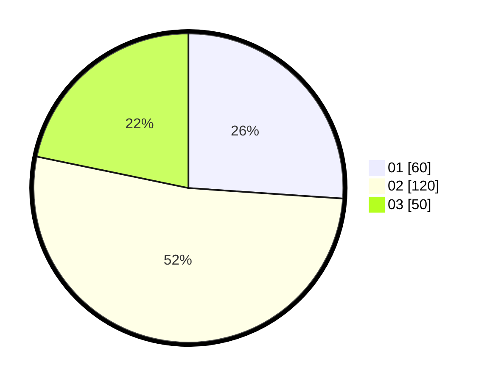

# Hasil

Hasil perolehan suara paslon dapat dilihat pada file paslon-01.txt, paslon-02.txt, dan paslon-03.txt.

Jika tidak ada, artinya data tersebut belum ada pada SIREKAP.

## Perolehan Suara

 * Paslon 01: **60**.
 * Paslon 02: **120**.
 * Paslon 03: **50**.

## Foto C Plano

https://sirekap-obj-formc.kpu.go.id/895d/pemilu/ppwp/31/71/03/10/02/3171031002031-20240215-035719--9daf2b91-5570-4221-bada-16be610be761.jpg

https://sirekap-obj-formc.kpu.go.id/895d/pemilu/ppwp/31/71/03/10/02/3171031002031-20240214-185840--7683556d-c186-4027-88a7-5f5c84ad5d06.jpg

https://sirekap-obj-formc.kpu.go.id/895d/pemilu/ppwp/31/71/03/10/02/3171031002031-20240215-035729--f58240da-e7ce-4682-93c2-e9923f462382.jpg

## DATA PEMILIH TETAP

Jumlah pemilih dalam DPT: **271**.
 * L: **142**.
 * P: **129**.

## DATA PENGGUNA HAK PILIH

Jumlah pengguna hak pilih dalam DPT: **212**.
 * L: **108**.
 * P: **104**.

Jumlah pengguna hak pilih dalam DPTb: **13**.
 * L: **13**.
 * P: **0**.

Jumlah pengguna hak pilih dalam DPK: **11**.
 * L: **6**.
 * P: **5**.

Jumlah pengguna hak pilih: **236**.
 * L: **127**.
 * P: **109**.

## JUMLAH SUARA SAH DAN TIDAK SAH

JUMLAH SELURUH SUARA SAH: **230**.

JUMLAH SUARA TIDAK SAH: **6**.

JUMLAH SELURUH SUARA SAH DAN SUARA TIDAK SAH: **236**.
